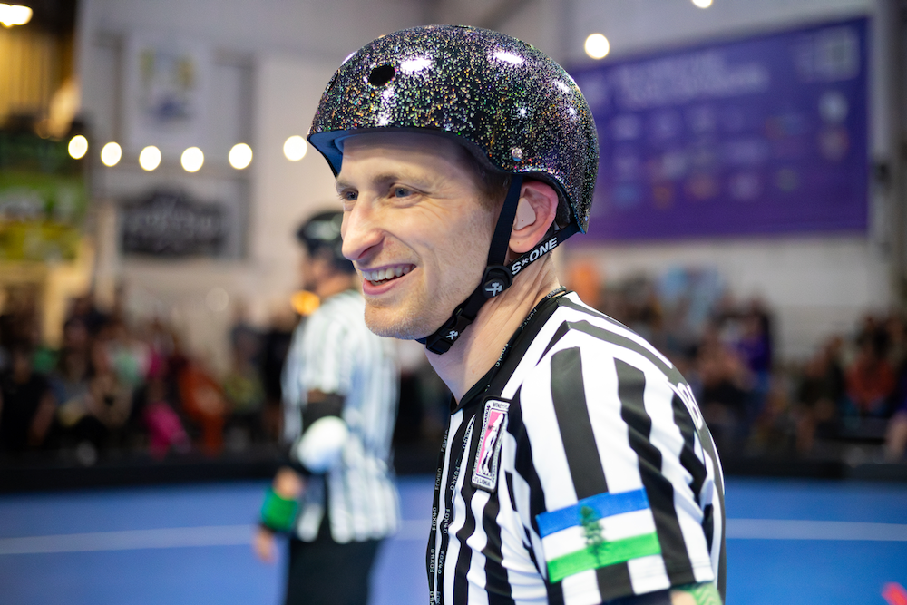
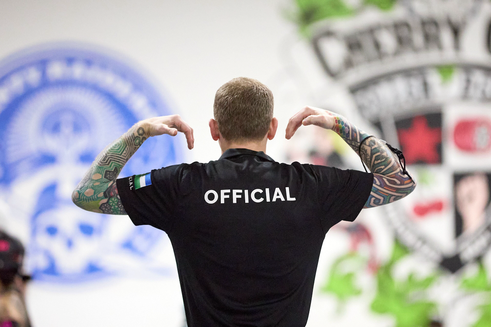

# WFTDA Evaluation History

## Overview

Below are exact copies of the text from all of my historical WFTDA officiating evaluations. I redacted the names of the evaluating officials, although I can provide them privately upon request.

<figure markdown>
{ width="500" style="filter: drop-shadow(0 0 0.2rem black)" }
    <figcaption style="font-size: 12px">
        IPR, RCR Home Team Game, May, 2025 
        Credit: [Double Dee :octicons-link-external-24:](https://www.instagram.com/deesphotogdump "@deesphotogdump on Instagram"){ target=_blank }
    </figcaption>
</figure>

---

## Evaluation #1 - JR, OPR

??? clipboard "Y'AllStars - 22-25 February, 2024 :material-cursor-default-click-outline:"

    === "Overview :material-cursor-default-click-outline:"

        [this is an automated email]

        Dear Breadpool (He/Him; Rose City Rollers),

        This is an automated email from Certification, designed to let you know that **REDACTED** (as a(n) Tournament Head Official) filled out an eval for Y'AllStars Southern Skate Showdown, an event from 2/22/2024 to 2/25/2024, involving 1 sanctioned games, 5 regulation games, "other" games described as "Breadpool officiated two games.  The first game was classified as other because it was a co-ed mashup, which had approximately 20 skaters on each team. The second "other" game was a co-ed game between Team Beast Side and Team Chicago." for WFTDA, JRDA, during which you served as JR, OPR.

    === "Evaluation :material-cursor-default-click-outline:"

        Here is the evaluation:

        Breadpool officiated during Y'allStars 2024 as a Jammer Ref and OPR.  As THR, I was able to watch Breadpool officate *(sic)* this 4 day tournament in these positions.  In every position he skated, Breadpool handled his responsibilities well.  He is very familar *(sic)* with the rules and has a great understanding of the impact spectrum.  He is not rushed in his calls and is very clear.  As an OPR, he is very fluid and dynamic.  He used non-standard hand signals to communicate with inside refs and had excellent communication with other refs.  He adjusts to pack changes very well as an OPR.  His positiioning *(sic)* was excellet *(sic)* as a Jam Ref and transistions *(sic)* well when the jammer is drawn back.  Breadpool would consistantly *(sic)* ask for feedback and he accepted the feeback *(sic)* well.  He participated in official reviews and provided concise answers to help the Crew Head made the necessary calls.  He also particated *(sic)* in rules discussions in between games.

    === "Broader Feedback :material-cursor-default-click-outline:"

        And here is the broader feedback:

        Breadpool didn't have any areas of improvement that were detriment to a game.  He did call off a jam early when the jammer only did one hand tap, but after the jam was called, he realized his mistake and apologized to the crew head and his jammer.  Breadpool always had a calm demeanor and a great attitude.  He never lost his cool during a stressful game.

        Cordially,
        Officials Certification

## Evaluation #2 - JR, OPR

??? clipboard "Y'AllStars - 22-25 February, 2024 :material-cursor-default-click-outline:"

    === "Overview :material-cursor-default-click-outline:"

        [this is an automated email]

        Dear Breadpool (He/Him; Rose City Rollers),

        This is an automated email from Certification, designed to let you know that **REDACTED** (as a(n) Crew Head Official) filled out an eval for Y'AllStars Southern Skatedown 2024, an event from 2/22/2024 to 2/25/2024, involving 2 sanctioned games, 5 regulation games, "other" games described as "1 -- our crew also officiated the fun open-gender Mardi Gras game (King Babycakes vs. Crew de Bruise), which was largely for show, where I believe Bread was sent to the box a few times by another ref, but it was MOSTLY regulation. :) " for WFTDA, JRDA, during which you served as JR, OPR.

    === "Evaluation :material-cursor-default-click-outline:"

        Here is the evaluation:

        Breadpool was a JR and OPR on my crew at Y'AllStars 2024. Breadpool is extremely strong on JR rules including star passes, lead eligibility, and points (Breadpool can always answer which skater's points were and were not earned), and he understands initiator, illegal actions, and impact well. As an OPR, Breadpool understands and issued penalties on trickier rules such as illegal assists and illegal contact for gaining speed out of bounds. His impact spectrum meshes well with that of other high-level refs I've worked with--he can defend calls and non-calls, and he does not overcall. Our crew was chosen to officiate the sanctioned Open Division final, and Breadpool was chosen to JR because he was one of the strongest JRs on the crew. Breadpool has the skating skills to manage JRing and OPRing a top-level, fast-paced open-gender game. The skaters were very knowledgable *(sic)* and vocal, and there was a degree of pressure associated with the game, but Breadpool performed very well.
        
        One moment of note was an official review requesting a call on Breadpool's jammer, when he did not quite have the angle to support a call. However, both PLTs saw the action and recommended a penalty. Breadpool was happy to have their perspective and issue the penalty on their recommendation, and went out of his way to thank them and give kudos for their support. Bread does not let ego restrict him in OR huddles and he values the input of off-skates officials. Bread is similarly kind, complimentary, and accessible to scorekeepers, and cross-trains as an SK and SBO to understand their perspective and challenges. Bread's experience in multiple officiating positions, on and off skates, give him a great understanding of game mechanics that is valuable on a crew.
        
        As the tournament progressed, our crew made a couple adjustments (for example, we slightly relaxed our insub metric to flex toward the other crews for consistency; we discussed and tweaked impact spectrum for blocking out of bounds). Breadpool adjusted well to the tournament-specific metrics. Breadpool is especially valuable as a communicator. He works hard to develop and implement clear "no call" informational signals such as initiator indications, "one hand went out," "contact to side," and others. He has very good instincts for passing on information to the HR about contact he's observing or escalation trajectories that will be helpful for speaking to the coaches so the HR can quickly address team concerns.
        
        Bread's penalty signals are clear and deliberate, and (speaking as a person who PLTs) he understands the importance of communicating his calls to the middle. Bread is also great at communicating with teams, coaches, and skaters: he is always appropriate and professional, and he treats teams and coaches as partners in facilitating great events.

    === "Broader Feedback :material-cursor-default-click-outline:"

        And here is the broader feedback:

        Breadpool didn't have any areas of improvement that were detriment to a game.  He did call off a jam early when the jammer only did one hand tap, but after the jam was called, he realized his mistake and apologized to the crew head and his jammer.  Breadpool always had a calm demeanor and a great attitude.  He never lost his cool during a stressful game.

        Cordially,
        Officials Certification

## Evaluation #3 - OPR

??? clipboard "WFTDA NA West Regional Playoffs - 14-16 June, 2024 :material-cursor-default-click-outline:"

    === "Overview :material-cursor-default-click-outline:"

        [this is an automated email]

        Dear Breadpool (He/Him; Rose City Rollers),

        This is an automated email from Certification, designed to let you know that **REDACTED** (as a(n) Crew Head Official) filled out an eval for WFTDA North America: West Regional Championship, an event from 6/14/2024 to 6/16/2024, involving 5 sanctioned games for WFTDA, during which you served as OPR.

    === "Evaluation :material-cursor-default-click-outline:"

        Here is the evaluation:

        Awareness, attention, focus, skating ability, triage, initiation and impact assessment, knowledge, judgment, and positioning are all of the highest caliber and exceed the expectations of even “play-off officials”. Breadpool reliably maintained the rear OPR position throughout the tournament’s games. Of particular note, his skating skills, even at speed, enabled him to maintain excellent positioning and focus even with fast-paced packs, however he didn’t hesitate to drop and rotate when necessary.

    === "Broader Feedback :material-cursor-default-click-outline:"

        None.

        Cordially,
        Officials Certification

## Evaluation #4 - JT

??? clipboard "Bridge City Riot - 20-21 April, 2024 :material-cursor-default-click-outline:"

    === "Overview :material-cursor-default-click-outline:"

        [this is an automated email]

        Dear Breadpool (He/Him; Rose City Rollers),

        This is an automated email from Certification, designed to let you know that **REDACTED** (as a(n) Other Official on the Same Crew) filled out an eval for Bridge City Riot, an event from 4/20/2024 to 4/21/2024, involving 3 sanctioned games for JRDA, during which you served as JT.

    === "Evaluation :material-cursor-default-click-outline:"

        Here is the evaluation:

        As a SBO, I appreciated Breadpool's calm presence and awareness on the track.  His focus helped me when I was needing to help newer SKs.  He regularly made sure the score table was ok and didn't need an OTO, at The Hangar in Portland, OR this is often something that JTs miss since the score table is upstairs and less visible from the track.  He communicated any clock adjustments clearly and we were sync'd up the whole weekend.

    === "Broader Feedback :material-cursor-default-click-outline:"

        None.

        Cordially,
        Officials Certification

## Evaluation #5 - JR, OPR

??? clipboard "Bridges & Boardwalks - 4-6 October, 2024 :material-cursor-default-click-outline:"

    === "Overview :material-cursor-default-click-outline:"

        [this is an automated email]

        Dear Breadpool (He/Him; Rose City Rollers),

        This is an automated email from Certification, designed to let you know that **REDACTED** (as a(n) Crew Head Official) filled out an eval for Bridges and Boardwalks, an event from 10/4/2024 to 10/6/2024, involving 4 sanctioned games, 1 regulation games, "other" games described as "none" for WFTDA, during which you served as JR, OPR.

    === "Evaluation :material-cursor-default-click-outline:"

        Here is the evaluation:

        I worked with Breadpool at the Bridges and Boardwalks tournament Oct 4-6, 2024 in Sacramento, CA. Breadpool worked one game as JR and the other for *(sic)* as OPR.

        Overall, Breadpool's skating skills are excellent.  He can maintain good position the majority of the time.  As front OPR when the pack would move to sprinting speed it was rare that he would lose position.  That said, there two times when he tried to do a powerslide to stop at the end of a sprint and almost slid off the track and into the stands. I did not mention it to him but kept an eye on it.  After the second time, he seemed to adjust his skating style and it did not happen again.  As the crew head/HR, several of our games required an intense amount of focus, so having an official who can self-correct is excellent.
        
        As JR Breadpool again has good skating skills.  He was very supportive of his fellow JR and worked well with the crew overall.  His points were correct and his impact spectrum is good.

        As an official Breadpool is very professional and easy to work with.  When asked a question during a timeout his responses are succinct and well thought out.

        The only minor piece of feedback that I have for Breadpool is that at times his seriousness on the track can make him seem a little unapproachable. He has an intense focus and a great respect for the role of officiating as a whole, which I appreciate. It seems to me that he forgets to switch off that intensity when interacting with other officials or skaters. This is an extremely minor thing and very nit-picky - as a whole I am always happy to work with Breadpool and am extremely thankful that he was on my crew.

    === "Broader Feedback :material-cursor-default-click-outline:"

        And here is the broader feedback:

        As a short-statured official, I greatly appreciate Breadpool's ability as a JR to do extremely low powerslides when coming into the pack while following their jammer.  This helped me keep my eyes on the pack and was extremely efficient in helping him maintain his position as a JR.

        Cordially,
        Officials Certification

## Evaluation #6 - SBO

??? clipboard "Rose City Rollers - Break Neck Betties vs. Black Diaspora Roller Derby - 12 October, 2024 :material-cursor-default-click-outline:"

    === "Overview :material-cursor-default-click-outline:"

        [this is an automated email]

        Dear Breadpool (He/Him; Rose City Rollers),

        This is an automated email from Certification, designed to let you know that **REDACTED** (as a(n) Crew Head Official) filled out an eval for Rose City Rollers - Break Neck Betties vs. Black Diaspora Roller Derby on 10/12/2024, a Regulation WFTDA game in which you performed as SBO.

    === "Evaluation :material-cursor-default-click-outline:"

        Here is the evaluation:

        Breadpool communicates well with the rest of the score table and the JT.  He is timely with inputs (SP, Lead, etc.).  If he has ever missed timing, he is quick to confirm with the JT or correct it himself using the available clocks.  He is focused and has a calm presence at the score table.

    === "Broader Feedback :material-cursor-default-click-outline:"

        None.

        Cordially,
        Officials Certification

## Evaluation #7 - JT

??? clipboard "Rose City Rollers - Rainbow Bites vs. Rose City Rollers - Death Scar Derby Droids - 13 October, 2024 :material-cursor-default-click-outline:"

    === "Overview :material-cursor-default-click-outline:"

        [this is an automated email]

        Dear Breadpool (He/Him; Rose City Rollers),

        This is an automated email from Certification, designed to let you know that **REDACTED** (as a(n) Crew Head Official) filled out an eval for Rose City Rollers - Rainbow Bites vs. Rose City Rollers - Death Scar Derby Droids on 10/13/2024, a Regulation JRDA game in which you performed as JT.

    === "Evaluation :material-cursor-default-click-outline:"

        Here is the evaluation:

        Breadpool has a great awareness of the track and game play.  He is good at being aware of when timeouts are called by the teams or when the officials need a timeout.  He communicates well with the SBO to make sure the clocks are accurate.  He also communicates important information to the HR and HNSO if requested (i.e. period clock expired).  Breadpool's signals are clear and accurate.  He shows a good understanding of the procedures for a JT.

    === "Broader Feedback :material-cursor-default-click-outline:"

        None.

        Cordially,
        Officials Certification

## Evaluation #8 - PBT

??? clipboard "Blood Fest 6 - 18-19 January, 2025 :material-cursor-default-click-outline:"

    === "Overview :material-cursor-default-click-outline:"

        [this is an automated email]

        Dear Breadpool (He/Him; Rose City Rollers),

        This is an automated email from Certification, designed to let you know that **REDACTED** (as a(n) Tournament Head Official) filled out an eval for Blood Fest, an event from 1/18/2025 to 1/19/2025, involving 1 sanctioned games for JRDA, during which you served as PBT.

    === "Evaluation :material-cursor-default-click-outline:"

        Here is the evaluation:

        During Blood Fest 6, game 4, I was HNSO and PLT. Breadpool was assigned to be one of the Penalty Box Timers and we shared the same team. His constant communication across the track and verification of penalty numbers with me as his PLT were smooth and perfect. His communication and signals with the skaters were clear and on point. I would have Breadpool be a part of any of my teams on or off skates. Huge fan. 10 stars.

    === "Broader Feedback :material-cursor-default-click-outline:"

        None.

        Cordially,
        Officials Certification

## Evaluation #9 - PBM, PBT, SBO

??? clipboard "Salem Slam III - 22-23 March, 2025 :material-cursor-default-click-outline:"

    === "Overview :material-cursor-default-click-outline:"

        [this is an automated email]

        Dear Breadpool (He/Him; Rose City Rollers),

        This is an automated email from Certification, designed to let you know that **REDACTED** (as a(n) Tournament Head Official) filled out an eval for Salem Slam III, an event from 3/22/2025 to 3/23/2025, involving 8 sanctioned games for MRDA, during which you served as PBT, PBM, SBO.

    === "Evaluation :material-cursor-default-click-outline:"

        Here is the evaluation:

        Breadpool performed multiple roles during a short-staffed tournament, and his ability to switch between those and work more games to fill spots on a crew is greatly appreciated.

        As a Scoreboard Operator, Breadpool had excellent communication with other members of the officiating crew. Points and leads were displayed quickly and accurately. Jam starts were synced up with the Jam Timer, and jam endings were equally precise. When the clock needed to be adjusted during a timeout, it was done efficiently and didn't involve any guessing and re-adjusting.

        When working in the penalty box (as both timer and manager), his verbal cues to skaters were loud and clear as were hand signals. PBT paperwork notation for sitting between jams was done correctly and matched with what the PLT recorded during the game. Even when the penalty box was busy, he was calm and accurate.

    === "Broader Feedback :material-cursor-default-click-outline:"

        Breadpool truly goes above and beyond for the roller derby community. I am always happy to work with him in any officiating capacity, on or off skates.

        Cordially,
        Officials Certification

## Evaluation #10 - PBT, SBO, STATS

??? clipboard "Hoagie Roll - 25-26 May, 2025 :material-cursor-default-click-outline:"

    === "Overview :material-cursor-default-click-outline:"

        [this is an automated email]

        Dear Breadpool (He/Him; Rose City Rollers),

        This is an automated email from Certification, designed to let you know that **REDACTED** (as a(n) Tournament Head Official) filled out an eval for Hoagie Rol 2025, an event from 5/24/2025 to 5/25/2025, involving 4 sanctioned games, "other" games described as "N/A" for JRDA, during which you served as PBT, SBO.

    === "Evaluation :material-cursor-default-click-outline:"

        Here is the evaluation:

        I worked with Breadpool in several capacities at Hoagie Roll, a open division championship-level JRDA tournament. I was the THNSO, but also worked in-game positions. On the NSO side, Breadpool worked as SBO (3 games) and PBT (1 game).

        I worked directly with Breadpool in the penalty box as PBT. His timing and paperwork were accurate even under the pressure of players cycling through the penalty box in high volume. He maintained consistent and clear communication with his paired PLT throughout the game, going to confirm penalties with every timeout. The venue was loud, but I could hear his instructions to the players the majority of the time; however, there were a few times that he could have been a little louder or clearer as the players did not always immediately recognise *(sic)* that they were good to return to the track. He also maintained communication with our PBM regarding number of penalties and jammer penalties. He kept a calm demeanour *(sic)* throughout the game and did not appear to be rushed.

        I got to experience Breadpool SBO from multiple perspectives over the weekend as THNSO, CHNSO, and PLT. Two of the games went very smoothly - jams started and ended in sync with the JT, points and lead status were awarded promptly, and communication between Breadpool and the SKs was clear and observable from all around the venue. I noticed Breadpool watching the JT and JRs for points and call offs. But the third game, Philly v FoCo, which was very high-intensity and high-volume being the same teams that played during the open division gold medal game at 2024 JRDA Championships, had some computer trouble. During the game, certain hotkeys were not responding, and even though Breadpool was clicking the button to end timeout, the scoreboard did not go into post-timeout. This issue occurred a few times, resulting in clock stoppages, but that was limited to the first half of the game as Breadpool became more conscious of the issue and worked around it accordingly.

        Additionally, during one of the jams in the first half, the scoreboard froze and stopped accepting input. Breadpool was able to promptly get my attention (I was CHNSO/PLT) and called for us to call off the jam. While there was initially some confusion as to whether the jam should have been called off or if the clock would have run off of the JT's clock, we determined that Breadpool made the right call in telling us to go into an OTO.

    === "Broader Feedback :material-cursor-default-click-outline:"

        After the Philly v FoCo game, Breadpool went to speak to the coaches out of his own volition to explain the situation that occurred with the scoreboard freezing. He was very collected and was taking accountability for requesting that the jam be called. I did not hear much of the conversation, but the Philly coach did talk to me afterwards saying how appreciative she was to hear the situation directly from him and that she respected him for taking accountability and seeking her out. It definitely calmed down a lot of nerves from a high intensity and high volume game, especially as Philly had been frustrated with the OTOs for the scoreboard.

        Cordially,
        Officials Certification

---

<figure markdown>
{ width="500" style="filter: drop-shadow(0 0 0.2rem black)" }
    <figcaption style="font-size: 12px">
        JT, Crow City Derby vs. Trans Rollers United, March, 2025 
        Credit: Divo
    </figcaption>
</figure>
