# Breadpool's Self-Evaluation

<figure markdown>
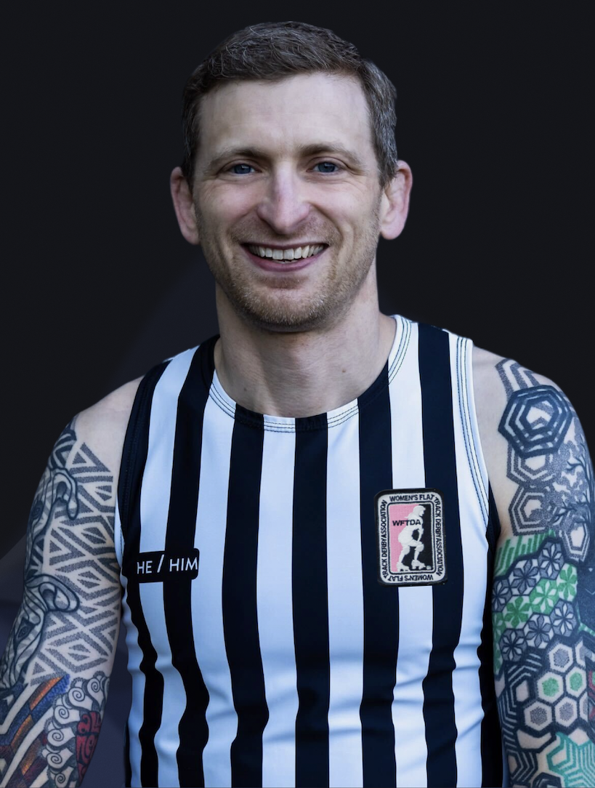{ width="400" style="filter: drop-shadow(0 0 0.2rem black)" }
    <figcaption style="font-size: 12px">
        Breadpool (Timothy Hull) 
        Credit: [Mckay Grundstein-Helvey :octicons-link-external-24:](https://www.instagram.com/mgh2pdx "@mgh2pdx on Instagram"){ target=_blank }
    </figcaption>
</figure>

Hello! I'm **Breadpool**(1), and this site is my roller derby officiating self-evaluation.  Please use the information in this site for details about my experience, strengths, and areas for growth.
{ .annotate }

1. !!! reference "Derby Name Meaning"

       My derby name is a combination of two things:

       1. I love to bake breads and pastries :fontawesome-solid-bread-slice:
       2. My superpower is recovering from injuries and surgeries :material-arm-flex:

The content of my self-evaluation appears in several sections, various tabs, and expandable note boxes.  Click or tap anywhere you see the :material-cursor-default-click: icon to view each part of my self-evaluation.

A Table of Contents menu appears on the left-side of all pages for quick access to separate pages:

1. [My Self-Evaluation](./index.md "Self-Evaluation") (this page).
2. [Game Video Clips](./game_video_clips.md "Game Video Clips") that detail specific instances of my officiating performances.
3. [My WFTDA Evaluations History](./evaluations.md#evaluation-history "My WFTDA Evaluations"){ data-preview }.
4. [My WFTDA OHD](./officiating_history.md "")

---

## About Me

=== "Dedication :material-cursor-default-click:"

    Simply for living where I happen to live, I've had the tremendous privilege of regularly learning from some of the most dedicated and experienced officials, players, coaches, league representatives, volunteers and stewards of the global roller derby community.
    
    Thank you for everything you've taught me, for your selfless support of my development, and for your dedication to the people you serve.  I promise to share what I’ve learned with anyone who wants to better themselves, and to use what you've taught me to emphatically support derby communities of all sizes, types, and ages, anywhere and everywhere derby lives.

     <figure markdown>
    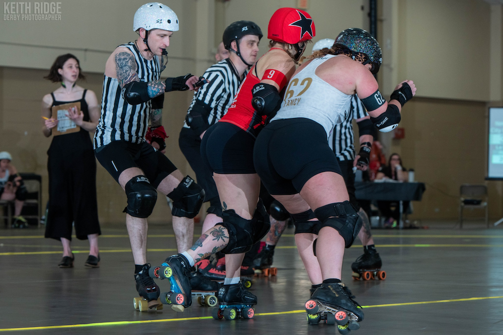{ width="500" style="filter: drop-shadow(0 0 0.2rem black)" }
        <figcaption style="font-size: 12px">
            JR, Franky Panky, New Jax vs. Red Stick, March, 2024 
            Credit: [Keith Ridge Derby Photos :octicons-link-external-24:](https://www.facebook.com/keithridgederbyphotos "keithridgederbyphotos on Facebook"){ target=_blank }
        </figcaption>
    </figure>

=== "Overview :material-cursor-default-click:"

    My self-evaluation encompasses both SO or NSO positions because I consider myself an **official** who works to earn the trust of my peers to excel in *all* roller derby officiating roles and at any level of competition.  I seek to continuously improve at *every* NSO and SO position because I believe the more I know in each role, the better I will be in every role.
    
    I work every single day to develop a deeper understanding of gameplay, rules theory, and the people involved in roller derby so I can support an ongoing improvement of the experience for teams, my peer officials, volunteers, spectators, and the global roller derby community.

    <figure markdown>
    { width="350" style="filter: drop-shadow(0 0 0.2rem black)" }
        <figcaption style="font-size: 12px">
            JT, Female Division JRDA Playoffs: Santa Cruz, June, 2024 (Timothy Hull) 
            Credit: [Mckay Grundstein-Helvey :octicons-link-external-24:](https://www.instagram.com/mgh2pdx "@mgh2pdx on Instagram"){ target=_blank }
        </figcaption>
    </figure>

=== "Profile :material-cursor-default-click:"

    - **Name:** Breadpool (Timothy Hull)
    - **Pronouns:** He/Him
    - **Age:** 44
    - **Home Town:** Portland, Oregon, USA
    - **Birth Town:** Annapolis, Maryland, USA
    - **League Affiliation:** RCR
    - **Languages:** English, Brazilian Portuguese
    - **Occupation:** Automation Software Development Consultant
    - **Fun Fact:** BJJ Black Belt

    <figure markdown>
    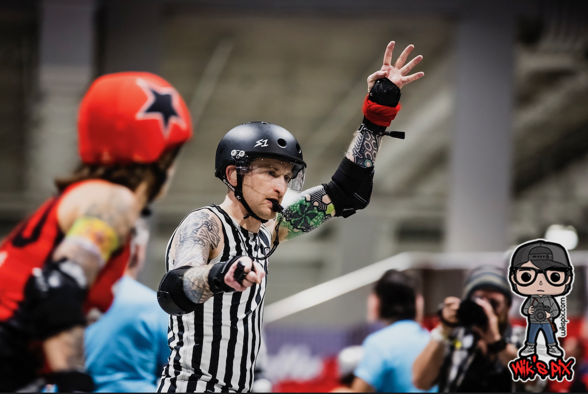{ width="500" style="filter: drop-shadow(0 0 0.2rem black)" }
        <figcaption style="font-size: 12px">
            JR, 187 Killer Pads vs. Triple 8, RollerCon 2024 
            Credit: [WiK's Pics :octicons-link-external-24:](https://www.instagram.com/wick2o "@wick2o on Instagram"){ target=_blank }
        </figcaption>
    </figure>

=== "My Officiating Background :material-cursor-default-click:"

    === "Non-Derby Officiating :material-cursor-default-click:"

        [I am newer to officiating roller derby](#__tabbed_2_2 "My Derby Officiating Background"), although I've been officiating various sports and competitive activities most of my life.  I started officiating when I was sixteen, operating the scoreboard at high school basketball games, and I've since officiated:

        - High school football.
        - High school Army JROTC drill competition.
        - U.S. Army recreational flag football.
        - BJJ tournaments at the local, regional, and international levels.

        I’ve been competing in sports throughout my life, including over 20 years of Brazilian Jiu-Jitsu competition. Officiating is one way I contribute to serving future generations of competitors while honoring the people who have officiated for my own competitive athletic experiences.

        Although each sport has unique officiating requirements and nuances, I find there are many common elements to the role of officiating across sports.  I make this point because I believe one of the reasons I've been able to integrate effectively with the roller derby officiating community within a few years is my prior officiating experience:

        - Conducting myself in keeping with the professional nature of an official.
        - Communicating effectively with players, coaches, other officials, staff, and spectators.
        - Understanding that even the nicest people sometimes become elevated during competition, and affording them the space to be elevated without judging them or taking things personally.
        - Deescalating intense situations between players, coaches, officials, etc.
        - Not allowing player, coach, or crowd reactions to impact my judgment or responses.
        - Observing and remembering the details of high-speed gameplay actions.
        - Understanding the importance of allowing players to determine the outcome of contests.
        - Remaining calm, composed, and effective during high-stakes competition.

        <figure markdown>
        { width="350" style="filter: drop-shadow(0 0 0.2rem black)" }
            <figcaption style="font-size: 12px">
                Referee, The Revolution 52, Puyallup, WA, July 2024 
                Credit: [Jason Tracy Photography :octicons-link-external-24:](https://www.instagram.com/pnwphotoj "@pnwphotoj on Instagram"){ target=_blank }
            </figcaption>
        </figure>

    === "Derby Officiating :material-cursor-default-click:"

        I began my derby officiating journey in August of 2022, although somewhat by accident.  My daughter was new to the roller derby community and wanted to spend more time on skates than was available to her in practices and scrimmages.  She decided to start attending officiating practice and asked that I join her so she wouldn't feel alone.
        
        I wanted to support my daughter and the roller derby community, and having skated and officiated in different capacities for the majority of my life, I felt comfortable giving roller derby officiating a shot.  I had no idea that I would leave that practice feeling like officiating roller derby was *the* thing I was meant to do.
        
        Since that day, I've poured my heart and soul into becoming a better official, believing I can serve people, many of whom live within social margins, in a way that allows them to live safer, more fulfilling lives.

        Where I happen to live affords me access to more opportunities to officiate roller derby than many people have, and I have access to highly experienced officials to learn from.  I do everything I can to use my privilege for good by officiating for leagues and teams that most need extra support. That means I frequently officiate roller derby:
        
        - Outside of my home league, often in rural areas.
        - For junior roller derby leagues and teams.
        - For beginner-level teams, including those who play modified-contact games.
        - For marginalized communities, teams, athletes, etc.
        - Whether or not the gameplay is sanctioned or adheres to regulation play guidelines.

        <figure markdown>
        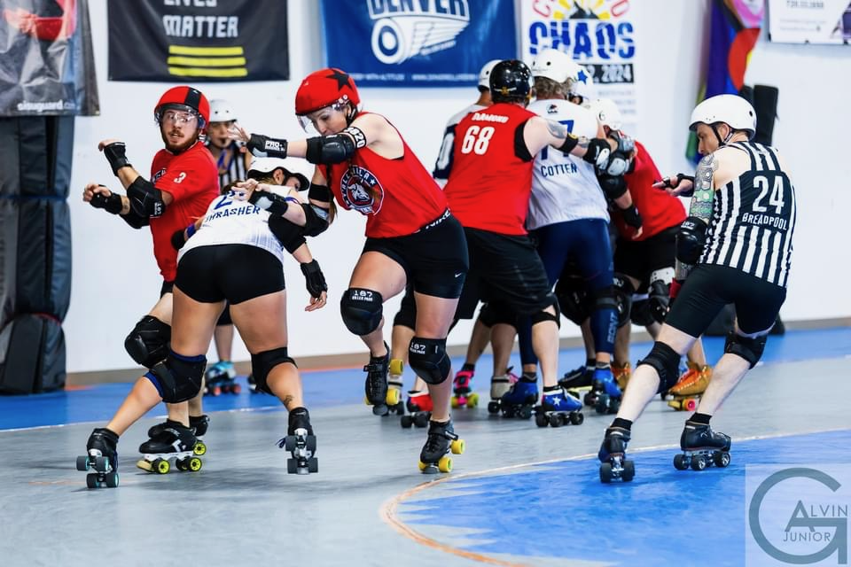{ width="500" style="filter: drop-shadow(0 0 0.2rem black)" }
            <figcaption style="font-size: 12px">
                JR, Ground Control vs. Y'allhalla, May, 2024 
                Credit: [Alvin Green Jr. Photography :octicons-link-external-24:](https://www.instagram.com/algreenjr1 "@algreenjr1 on Instagram"){ target=_blank }
            </figcaption>
        </figure>

---

## What to Expect From Me

I believe the best officiating happens when a crew operates as a selfless, supportive, and blameless team that focuses on being better today than they were yesterday.  These are the qualities you can expect from me as a member of an officiating crew:

??? bread "1. My Mindset :material-cursor-default-click:"

    - I approach officiating just like I do playing any competitive sport, with the exception that my opponent isn't another person or team.
    - In my mind, **mistakes** are the opponent I ferociously train to beat, while recognizing mistakes are a relentless opponent that will never allow me to be rest.
    - I respect my opponent, although I do not fear them.
    - I seek to challenge my opponent at the highest levels because I'm driven to "win," and I prepare to be successful in the biggest moments.
    - "Winning" means my peers and I supported safe, fair gameplay in which the competing teams feel like they control the outcome.
    - I give my all to be the best teammate anyone has ever had, always seeking self-improvement and working to be someone who my peers trust, feel safe with, and love to work with.

??? bread "2. Extreme Positivity :material-cursor-default-click:"

    - I show up with high enthusiasm, friendliness, excitement, and positivity to share with the officials I serve with, no matter how challenging game conditions might be.
    - Regardless of the circumstances, I bring fist bumps, high-fives, and verbal "Let's go!" cues to support and encourage my peers throughout the duration of each contest in an event.
    - I seek responsibility for my mistakes, make in-game adjustments, avoid dwelling on my mistakes so I keep my head in the game, and immediately extend apologies, where appropriate, to the people I impact with my mistakes.
    - I have the backs of my on- and off-skates crewmates, *always*, and they can count on me to encourage them in difficult situations.
    - When my officiating peers and leadership need me to make adjustments, I don’t dig my heels in about doing things a certain way, I give them my full support and do what they need me to do.

??? bread "3. Strenuous Preparation :material-cursor-default-click:"

    - I practice developing and improving officiating skills, on- and off-skates at least 4 hours per week, and often upwards of 10 hours per week.
    - I actively seek feedback from other officials and relentlessly study game video to continuously learn and improve, and to position myself to best support safe and fair gameplay.
    - I physically train and condition 5-12 hours per week to maintain a high level of fitness, improve my ability to be in the best position to observe game action, and ensure I will not experience physical fatigue no matter how strenuous the environmental or game conditions might be.
    - I regularly study roller derby rules and cases to continuously develop a better understanding of roller derby rules theory because I believe learning to understand rules theory helps me quickly work through complex situations in a way that supports the best and safest possible gameplay experience.

??? bread "4. Empathic Listening :material-cursor-default-click:"

    - I actively listen to officials, players, and coaches with genuine effort and concern to understand their points of view.
    - I seek to build trust by showing officials and teams they are heard and understood, even in cases where we may disagree with each other.
    - I actively solicit feedback from my peer officials by telling them no feedback will hurt my feelings.
    - For me, feedback is information I can use to be better today than I was yesterday, and I want to understand my mistakes, not ignore or hide from them.

??? bread "5. Clear and Kind Communication :material-cursor-default-click:"

    - I speak to everyone with courtesy and respect, no matter how I am spoken to.
    - I do everything I can to actively communicate information with other officials in a way that promotes smooth, continuous game flow.

??? bread "6. Keeping Athletes on the Track :material-cursor-default-click:"

    - I believe gameplay is best when athletes are on the track, not in the penalty box, and I observe game action in a way that seeks to avoid issuing penalties whenever possible.
    - For any action that might create sufficient game impact to warrant penalties, I describe the game impact to myself in a way I can recite during an official review *before* I issue any penalties (e.g., "Low block on yellow 2-4; caused purple 2-4 to go down").
    - I maximize the use of verbal warnings, prescribed by gameplay rules, to help athletes avoid committing penalties.
    - When I issue penalties, I include as much "3-star" information as possible to help athletes understand my basis for issuing penalties and help them avoid being assessed with the same penalty again (e.g., "Yellow 2-4, forearm; bracing on an opponent.").

??? bread "7. Zone Ownership :material-cursor-default-click:"

    - I focus on officiating specifically within the confines of my area/zone of responsibility.
    - Said another way, I avoid immediately issuing penalties for actions I may not have the best point of view to observe.
    - If I believe I may have observed game action outside of my zone that warrants a penalty or even warrants reversing a penalty, I seek to discuss my observations with other officials during lineups to collaborate on our points of view and reach the best possible outcome.

??? bread "8. Hustle :material-cursor-default-click:"

    - No matter what I do, I move with the utmost sense of purpose, often sprinting back and forth, to show everyone around me that my concern for serving the teams and peers I officiate with is equivalent to that of the highest-level competitors.
    - I apply the skills I've developed in over 20 years of Jiu-Jitsu and Judo training and competition to reduce the probability that I will fall and to recover from a fall with precision and explosiveness.
    - If I end up on the ground, I maintain eye contact with my zone of coverage to the extent possible, and return to my assigned responsibilities immediately, even if I am in discomfort from whatever took me down.

??? bread annotate "9. Versatility :material-cursor-default-click:"

    - Although this application is specific to SO roles, I work hard to continuously build skill and experience at each officiating position, on- and off-skates because I believe learning and practicing each role helps me be a better official and teammate for my SO and NSO peers.
    - I actively work to keep my OHD balanced between SO and NSO roles, officiating ≈2/3 of games in SO roles and ≈1/3 of games in NSO roles.
    - Whenever needed, I am comfortable serving in any SO or NSO role, with or without advanced notice.

??? bread "10. Courage To Do What's Right :material-cursor-default-click:"

    - Making split-second, difficult decisions is simply part of being an official, and I believe that applies to all levels in all sports.
    - Of course, there are no prescriptive guidelines for what the "right" thing to do is, although my peers can count on me to use good judgment, be decisive in key moments, and own responsibility for the decisions I make, whatever the outcome.

---

## My Strengths and Areas for Growth

Please click to expand the sections below for detailed information about my development in each officiating role.

??? bread "NSO Positions :material-cursor-default-click:"

    In any NSO position, you can expect me to consistently exhibit and excel at:

    - **Precision** - precise and accurate timing, precise and clear communication, and precise adherence to established policies and procedures.
    - **Attention to detail** - for me, "done" means "done correctly," and that means not taking shortcuts, asking questions when something seems wrong, and doing everything I can to preserve the integrity of the sport.
    - **Thorough preparation** - I do not rely on past experience or wishful thinking to be sure I will do a good job at something.  I accept the responsibility to thoroughly study and practice for my assigned roles, before every single opportunity I have to officiate.
    - **Rules and procedures knowledge and currency** - I keep current with rules and procedures updates so I am ready to take and explain the correct actions for any given situation while applying the appropriate situational discretion and judgment to facilitate safe and fair gameplay.
    - **Teamwork** - I communicate with my peer NSOs and SOs in ways that demonstrate empathy, understanding, inclusiveness, courtesy, support, respect, and validation.

    <figure markdown>
    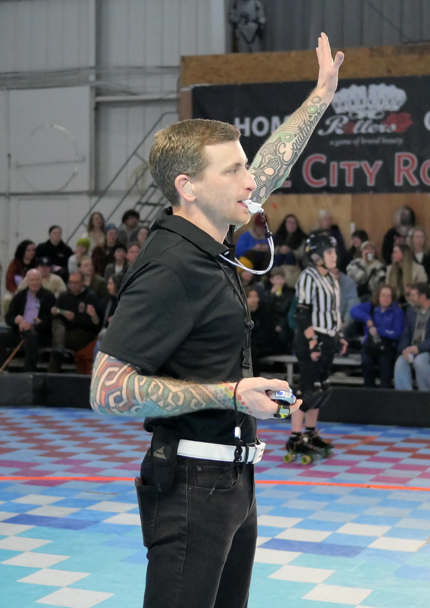{ width="400" style="filter: drop-shadow(0 0 0.2rem black)"}
        <figcaption style="font-size: 12px">
            JT, RCR Adult Regulation Game, December 2023 
            Credit: [Steven L. Price](https://stevenlprice.smugmug.com "StevenLPrice on SmugMug"){ target=_blank } :octicons-link-external-24:
        </figcaption>
    </figure>

    ??? clipboard "HNSO/CHNSO-Specific :material-cursor-default-click:"

        === "My Strengths :material-cursor-default-click:"

            - Early partnering and preparation with my peer HR/CHR to create and demonstrate unified and collaborative officiating.
            - Communication with teams and host leagues to ensure I have the data necessary to prepare accurate IGRF(s).
            - Accurate pre-game IGRF preparation and post-game stats book publication (for internal league consumption).
            - Maximizing opportunities for other officials by assigning them to all available roster positions instead of assigning myself a second position.
            - Demonstrating and understanding of and experience with the responsibilities and procedures associated with each NSO position, which allows me to support to any member of my crew who may need help.
            - Helping develop new officials by providing safe opportunities for them to learn under my mentorship or that of other experienced officials.
            - Supporting officials who are developing experience with CHR/HR roles by acting as a safety net if they need assistance.
            - Having the backs of my peer officials so they can do their jobs without concern that they might have to deal with elevated or frustrated players and coaches directly.
                - I want and seek the responsibility of deescalating and resolving conflict between teams and officials so my peers can work in an environment where they feel safe.

        === "My Areas for Growth :material-cursor-default-click:"

            - At this stage of my development, I have very limited experience in CHNSO and HNSO roles.
                - Even though I have access to a high volume of roller derby games, CHNSO and HNSO roles are often assigned to officials with vastly more experience than me.
                - I intend to seek opportunities to serve in the CHNSO and HNSO roles outside of my home league and at tournaments that specifically seek officials who want to develop experience in new roles, including RollerCon.
            - Although I've worked with the WFTDA and JRDA IGRF and stats book forms regularly, I do not have experience with the game sanctioning or stats book submission processes.

    ??? stopwatch "JT-Specific :material-cursor-default-click:"

        === "My Strengths :material-cursor-default-click:"

            - Deliberate and audible verbal cues, even in venues where acoustics may present challenges.
            - Deliberate and clear visual cues/hand signals.
            - Precision timing alignment between my verbal/visual cues and the scoreboard clocks.
            - Intently monitoring team benches between jams to respond to requests for timeouts or ORs immediately.
            - Methodically transitioning from monitoring team benches to jam start preparation as the lineup clock approaches 0:25.  My methodology involves:
                - Ensuring medical staff are available and have their attention on the track area.
                - Verifying that each team has at least one blocker and one jammer in legal starting positions.
                - Checking with the SBO and SKs to be sure they are ready for the next jam to start.
                - Monitoring the HR for any indication they may not be ready to start the jam.
            - Accurately providing backup timing for the official game and jam clocks.
            - Supporting the SBO with clock and timeout consumption adjustments.
            - Physical endurance to continuously deliver visual cues during game stoppages for extended periods.

        === "My Areas for Growth :material-cursor-default-click:"

            - I need to improve my consistency as a JT by serving as a JT more regularly.
                - I will often go months without serving as a JT, and, even with advanced preparation, it may take me several jams to relax and feel like I'm not having to think about everything I'm doing and need to do.
            - I will sometimes focus so much on responding to timeouts as quickly as possible that I forget to immediately stop my game clock stopwatch.
                - I need to continue to practice holding my game clock stopwatch in a way that allows me to simultaneously signal timeouts and press the "Stop" button.

    ??? stopwatch "PBM-Specific :material-cursor-default-click:"

        === "My Strengths :material-cursor-default-click:"

            - Emphasis on timing penalties as accurately as possible.
                - I focus on starting and stopping stopwatches at the precise time prescribed by gameplay rules.
            - Understanding of and familiarity with jammer swap scenarios, including scenarios that require both jammers to remain seated in the penalty box during a jam (A-B-A, etc.).
            - Clear and audible verbal cues.
            - Clear visual cues/hand signals.
            - Ability to support and advise officials developing experience in the PBT role, including helping them properly fill out the PBT paperwork.
            - Understanding of penalty codes and familiarity with the process to indicate served and unserved penalties using a whiteboard.
            - Understanding of illegal actions and comfort assessing role-specific penalties when necessary.
            - Understanding of player foul-out procedures.

        === "My Areas for Growth :material-cursor-default-click:"

            - At this stage of my development, I have very limited experience in the PBM role.
            - Even though I have access to a high volume of roller derby games, PBM roles are often assigned to officials with vastly more experience in the PBM role than me.
                - I intend to seek opportunities to serve in the PBM role outside of my home league and at tournaments that specifically seek officials who want to develop experience in new roles, including RollerCon.

    ??? stopwatch "PBT-Specific :material-cursor-default-click:"

        === "My Strengths :material-cursor-default-click:"

            - Emphasis on timing penalties as accurately as possible.
                - I focus on starting and stopping stopwatches at the precise time prescribed by gameplay rules.
            - Understanding of PBT responsibilities and timing procedures.
            - Understanding of and experience with filling out PBT paperwork.
            - Awareness to ensure alignment of PBT paperwork with PLT records during game stoppages.
            - Clear and audible verbal cues.
            - Clear visual cues/hand signals.
            - Experience with and composure while managing instances of high penalty volume within short periods of time.
            

        === "My Areas for Growth :material-cursor-default-click:"

            - I need to serve as a PBT more frequently in order to keep from feeling "rusty" when I do serve as a PBT.
                - It may take me several jams to feel like I am performing my responsibilities without having to actively think about of everything I need to do.
            - I typically use a "single watch" technique to time penalties, and some CHNSOs/HNSOs prefer a "dual watch" technique that I don't practice regularly.
                - For instances where there is only a single player in the penalty box for the team I'm assigned to track, the single and dual watch techniques are indistinguishable on the PBT paperwork.
                - When there are multiple players serving penalties simultaneously, I use a running clock to record the time a player sits, stands, and completes their penalty.
                    - Some CHNSOs/HNSOs prefer that all players sit at 0 seconds, stand at 20 seconds, and complete service at 30 seconds (assuming I'm not recording timing for a jammer swap).
                    - The single watch technique I use may show that a player sits at 16 seconds, stands at 36 seconds, and completes service at 46 seconds.
                - It's important that I practice the dual watch technique in order to best support the needs of my assigned CHNSOs/HNSOs.

    ??? tablet "PLT/ePLT-Specific :material-cursor-default-click:"

        === "My Strengths :material-cursor-default-click:"

            - Familiarity and experience with both the PLT paperwork and ePLT interface.
            - Practiced at filling PLT paperwork in a way that's clear and legible.
            - Strong understanding of WFTDA and JRDA stats book guides that allows me to accurately track penalties and lineups for uncommon scenarios.
            - Understanding of penalty codes and familiarity with quickly translating SO verbal and visual cues to penalty codes.
            - Ability to switch between PLT and ePLT record keeping at a moment's notice.
            - Awareness to ensure alignment of PLT records with PBT paperwork during game stoppages.
            - My SO experience helps me anticipate and quickly process SO verbal and visual cues.
            - Regularly working with CRG, including beta versions, allows me to quickly recover ePLT software connectivity in the event of errors.
            - Well-practiced recovering from accidental or incorrect ePLT interface taps.
            - Familiarity and experience with using the ePLT interface to perform less common tasks including:
                - Mark a player as having to sit for three jams.
                - Adding and removing box trips.
                - Player expulsions.
            - Comfort with supporting the development of a peer PLT whether in both the PLT and ePLT roles.
            - Quickly identifying and marking the jammer and pivot in the ePLT interface during lineups so the SBO can focus on other tasks during lineups.

        === "My Areas for Growth :material-cursor-default-click:"

            - I am dyslexic, and I sometimes struggle to quickly and correctly identify all non-pivot blockers participating in a given jam.
            - While serving in the ePLT role, I need to improve the precision of the timing for marking players who are serving and done with their penalties.
                - I will occasionally be slow to indicate that a player completed their penalty service.
            - I lack experience and practice with:
                - PLT/ePLT recording of non-player expulsions.
                - The separate roles of Penalty Tracking and Lineup Tracking.
            

    ??? clipboard "PW-Specific :material-cursor-default-click:"

        === "My Strengths :material-cursor-default-click:"

            - Comfort with supporting the development of officials who are learning the PLT/ePLT roles by:
                - Quickly and accurately translating and relaying SO-issued penalties.
                - Teaching the stats book guide prescribed methodologies for accurately recording penalties and lineups.

        === "My Areas for Growth :material-cursor-default-click:"

            - I do not serve in the PW role frequently, and it seems to take me several jams to understand the needs of the officials serving in PLT/ePLT roles.
            - I need to be more proactive as a PW, and communicate better with officials serving in the PLT/ePLT roles before a game so I can provide them with the most precise and helpful feedback.

    ??? laptop "SBO-Specific :material-cursor-default-click:"

        === "My Strengths :material-cursor-default-click:"

            - TODO

        === "My Areas for Growth :material-cursor-default-click:"

            - TODO
            - TODO
    
    ??? clipboard "ALTN-Specific :material-cursor-default-click:"

        === "My Strengths :material-cursor-default-click:"

            - TODO

        === "My Areas for Growth :material-cursor-default-click:"

            - TODO
            - TODO

??? bread "SO Positions :material-cursor-default-click:"

    In any SO position, you can expect me to consistently exhibit and excel at:

    - Skating skills and speed that allow me to reliably be *exactly* where I need to be, rapidly recover if I am forced out of position, and avoid making contact with other players in situations where they may not be able to avoid making contact with me.
    - Awareness of which players have, earn, retain, lose, and reestablish superior positioning as players go out-of-bounds and return to in-bounds positions.
    - Thoroughly assessing and understanding which players initiate contact with other players.
    - Thoroughly assessing contact initiation game impact *before* I issue or decline to issue penalties.
    - Awareness of detailed information about the actions I observe that includes player-specific details (team and jersey number).
    - Continuous and dynamic positioning and repositioning to always be in the best position to observe game action.
    - Clear, slow, and slightly prolonged whistle blasts to help my peer officials in SO and NSO roles understand where and when to turn their attention.
    - Highly visible, deliberately slow, and consistently repeated verbal and visual cues to help my peer officials in SO and NSO roles understand exactly what I am observing and reporting.
    - Delivering verbal and visual cues, including issuing penalties, while maintaining the appropriate positioning for my SO role.
    - Maintaining observation of players before, during, and after each jam to ensure any potential contact or communication between teams has coverage.
    - Tracking the number of players and the positions for each player on each team before and during a jam.
    - Understanding and applying WFTDA rules in keeping with established rules theory and the appropriate situational discretion and judgment to facilitate safe and fair gameplay.
    - Behaviors that show inclusiveness, courtesy, support, respect, and validation to NSOs.

    <figure markdown>
    { width="400" style="filter: drop-shadow(0 0 0.2rem black)"}
        <figcaption style="font-size: 12px">
            JR, 187 Killer Pads vs. Triple 8, RollerCon 2024 
            Credit: [Jenni Weber Photography](https://www.instagram.com/jenniwebberphotography "@jenniwebberphotography on Instagram"){ target=_blank } :octicons-link-external-24:
        </figcaption>
    </figure>

    ??? whistle "OPR-Specific :material-cursor-default-click:"

        === "My Strengths :material-cursor-default-click:"

            As an OPR, you can expect me to consistently exhibit and excel at:

            - Demonstrating high proficiency at each OPR position and the capacity to switch between any OPR position at any time without disrupting gameplay or creating a coverage gap.
            - Being the earliest and most decisive "dropping" OPR in the world, seeking to rapidly stop, accelerate in non-derby direction, and recover a new position whenever the speed of the pack has even the slightest potential to put me and my peers out of position.
            - Awareness of earned passes within my zone, to support the JR's on my crew with accurate points reporting.
            - Frequently communicating with my OPR peers to ensure our collective positioning and ability to observe game actions is optimal.
            - Non-verbal communication with players (pointing) reporting to and returning from the penalty box to help ensure they enter and exit the track safely.
            - Lateral movement that allows me to predominantly face my entire body toward the pack, giving me the best possible view of the pack and allowing me to rapidly accelerate and decelerate in any direction at any time.

            <figure markdown>
            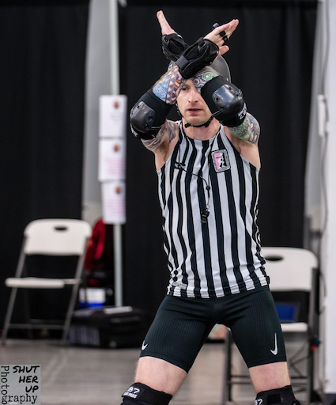{ width="250" style="filter: drop-shadow(0 0 0.2rem black)" }
                <figcaption style="font-size: 12px">
                    OPR, WFTDA NA West Playoffs, June, 2024 
                    Credit: [ShutHerUp Photography :octicons-link-external-24:](https://www.facebook.com/ShutHerUpPhotography "ShutHerUpPhotography on Facebook"){ target=_blank }
                </figcaption>
            </figure>

        === "Positioning Methodology :material-cursor-default-click:"

            - As a **rear** OPR, I am, generally:

                1. Parallel with a well-defined rear wall.
                2. Ready to rapidly accelerate in non-derby direction to follow and remain even with players up to the trailing edge of the rear engagement zone.
                3. Shifting slightly behind the rear wall when jammers approach, so I can observe contact to the rear wall.
                3. Shifting slightly in front of the rear wall to observe for illegal blocking techniques that create game impact.
                4. In position to observe player positioning relative to the jammer line and outside boundary at the start of each jam.

            - As a **middle** OPR, I am, generally:

                1. Parallel with a well-defined front wall of 3+ blockers.
                2. Ready to rapidly accelerate in non-derby direction to observe the rear wall from the front when the front wall has 2 or fewer blockers.
                3. Ready to reposition to be parallel with the rear wall when the rear OPR follows blockers moving in non-derby direction to the edge of the rear engagement zone, and ready to return to observing the front wall as the rear OPR reassumes control of the rear wall.
                4. In position to observe player positioning relative to the pivot line and outside boundary at the start of each jam.

            - As a **front** OPR, I am, generally:

                1. 7-12 feet in front of the pack, directly next to the outside boundary looking in non-derby direction when the front wall has 3+ blockers.
                2. Ready to rapidly transition to be parallel with a front wall of 2 or fewer blockers while maintaining a position that prevents blockers from getting forward of my position.
                3. Ready to reposition to be parallel with the front wall when the middle OPR positions themselves to be parallel with the rear wall, and ready to return to a position forward of the front wall when the middle OPR positions themselves to be parallel with the front wall.

            <figure markdown>
            { width="400" style="filter: drop-shadow(0 0 0.2rem black)" }
                <figcaption style="font-size: 12px">
                    OPR, Female Division JRDA Playoffs: Santa Cruz, June, 2024 
                    Credit: [Mckay Grundstein-Helvey :octicons-link-external-24:](https://www.instagram.com/mgh2pdx "@mgh2pdx on Instagram"){ target=_blank }
                </figcaption>
            </figure>

    ??? whistle "JR :material-cursor-default-click:"

        === "My Strengths :material-cursor-default-click:"

            As a JR, you can expect me to consistently exhibit and excel at:

            - Keeping eyes on my jammer at *all* times to ensure nothing they do goes unobserved.
            - Clear, kind, and supportive communication with my SK, before, during, and after each game.
            - Awareness of potential NOTT points and understanding of when a jammer earns and does not earn those points.
            - Timely and accurate tracking and recall, by player, of earned passes, points, superior position, and positional gain.
            - Confident points reporting immediately after a jam ends (after the fourth whistle, not the twelfth whistle).
            - Continuous monitoring of the relationship between what I report to my SK and the information on the scoreboard.
            - Awareness of the space I occupy, how my position impacts my peer JR, and the ability to adapt to support fluid, dynamic movement with my peer JR throughout a tournament.
            - Anticipating situations that may result in a star pass that is difficult to see.
            - Lateral movement that allows me to predominantly face my entire body toward my jammer, giving me the best possible view of my jammer and allowing me to rapidly accelerate and decelerate in any direction, at any time.
            - Precision responsiveness to jammer call-offs.

            <figure markdown>
            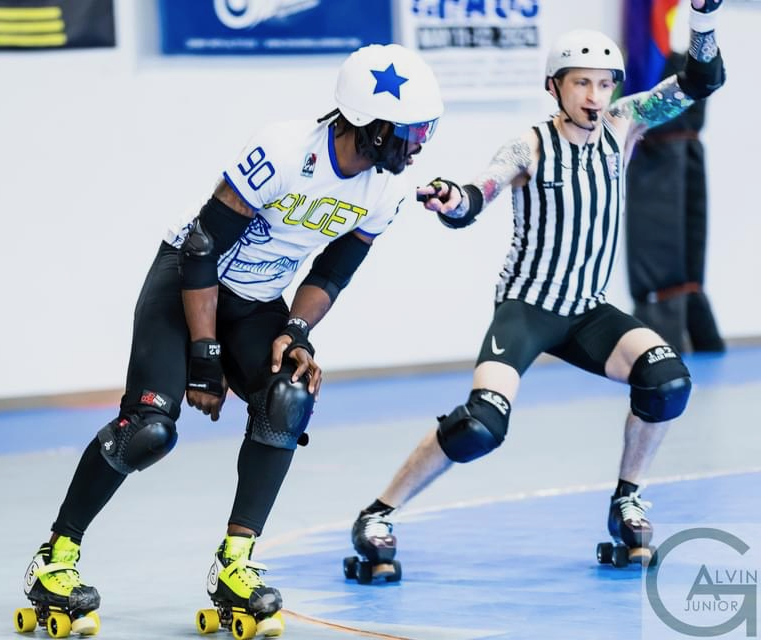{ width="400" style="filter: drop-shadow(0 0 0.2rem black)" }
                <figcaption style="font-size: 12px">
                    JR, Ground Control vs. Y'allhalla, May, 2024 
                    Credit: [Alvin Green Jr. Photography :octicons-link-external-24:](https://www.instagram.com/algreenjr1 "@algreenjr1 on Instagram"){ target=_blank }
                </figcaption>
            </figure>

        === "Positioning Methodology :material-cursor-default-click:"

            - Before each jam, I identify my jammer and align myself with their position, making sure I can observe their actions before and after the jam starting whistle.
            - Precise alignment with my jammer throughout the duration of each jam in a way that allows me to continuously and accurately observe my jammer's position relative to other players.
            - Frequent use of wheel-stopping techniques (hockey stops, power slides, etc.) to keep alignment with my jammer as they dynamically move within the pack and throughout the track.

            <figure markdown>
            { width="400" style="filter: drop-shadow(0 0 0.2rem black)" }
                <figcaption style="font-size: 12px">
                    HR, AoA vs. Rat City, October, 2023 
                    Credit: [Jonathan Works Photography :octicons-link-external-24:](https://www.facebook.com/worksphoto "worksphoto on Facebook"){ target=_blank }
                </figcaption>
            </figure>

    ??? whistle "IPR :material-cursor-default-click:"

        === "My Strengths :material-cursor-default-click:"

            As IPR, front or rear, you can expect me to consistently exhibit and excel at:

            - Comfort and confidence working from the front or rear IPR positions, depending on my HR/CHR's position preference.
            - Ability to define and track pack location plus adapt to the to the pack definition metrics of my peer IPR.
            - Ability to adapt to the pack reformation penalty metrics of my peer IPR such that reformation penalty distribution is fair and consistent.
            - Ability to monitor the precise location of skaters to accurately report pack conditions and movement.
            - Awareness of situations that may result in unexpected no-pack split scenarios.
            - Clear and loud verbal and visual cues that allow players to quickly understand and respond to warnings before penalty assessment.
            - Ability to rapidly and dynamically change my positioning and focus as game conditions and pack activities dictate.
            - Capacity to relay information information between officials, including relaying penalties from OPRs to PLTs.
            - Capacity to relay to JRs which players are OOP, NOTT, etc. and when, to support JRs accurate tracking and points reporting.
            - Ongoing communication with other officials about pack location and player positioning relative to the pack, specifically communicating the location of jammers relative to the pack and front engagement zone to JRs.
            - Awareness of where players re-enter the track relative to the front engagement zone.
            - Ability to "chase down" and issue an OOP warning to a pivot who leaves the front engagement zone while believing they are a jammer, after unsuccessfully taking a star pass.
            - Ability to rapidly accelerate while skating backward and skate backward at high speed without the need to look at the track boundary to ensure I remain off of the gameplay area.

            <figure markdown>
            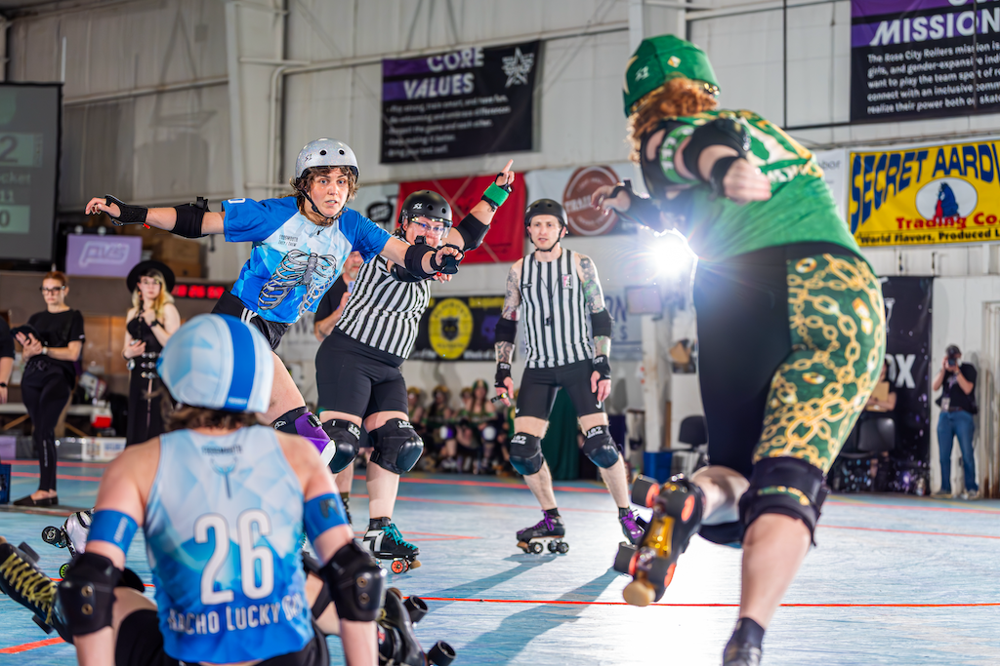{ width="400" style="filter: drop-shadow(0 0 0.2rem black)" }
                <figcaption style="font-size: 12px">
                    IPR, RCR Home Team Champs, June, 2024 
                    Credit: [Jonathan Works Photography :octicons-link-external-24:](https://www.facebook.com/worksphoto "worksphoto on Facebook"){ target=_blank }
                </figcaption>
            </figure>

        === "Positioning Methodology :material-cursor-default-click:"

            - As a **front** IPR, I am, generally:

                1. 7-10 feet in front of the pack, directly next to the inside boundary looking in non-derby direction when the pack is well-defined and managed by the rear IPR.
                2. Ready to rapidly transition to a position where I am centered on the pack when the rear IPR moves to follow players in the rear engagement zone.
                3. Ready to move out of the path of both JRs and quickly recover my original position.
                4. Ready to provide primary pack definition coverage for the rear IPR in the event they are not available at the start of a jam or become unavailable during a jam.
            
            - As a **rear** IPR, I am, generally:

                1. Centered on the pack when the pack is well-defined.
                2. Ready to rapidly accelerate in non-derby direction to follow and remain even with players up to the trailing edge of the rear engagement zone.
                3. Shifting slightly behind the rear wall when jammers approach, so I can observe contact to the rear wall.
                4. Shifting slightly in front of the rear wall to observe for illegal blocking techniques that create game impact.
                5. Ready to move out of the path of both JRs and quickly recover my original position.
                6. In position to observe player positioning relative to the jammer line and inside boundary at the start of each jam.

            <figure markdown>
            { width="400" style="filter: drop-shadow(0 0 0.2rem black)" }
                <figcaption style="font-size: 12px">
                    IPR, Colorado Chaos, JRDA Sanctioned Game, May, 2024 
                    Credit: [Alvin Green Jr. Photography :octicons-link-external-24:](https://www.instagram.com/algreenjr1 "@algreenjr1 on Instagram"){ target=_blank }
                </figcaption>
            </figure>

    ??? clipboard "ALTR :material-cursor-default-click:"

        === "My Strengths :material-cursor-default-click:"

            I take the ALTR role very seriously and seek opportunities to serve as an ALTR.  You can expect me to volunteer to serve as an ALTR with enthusiasm, engagement, and a focus on helping my officiating peers excel. As an ALTR, you can expect me to consistently exhibit and excel at:

            - Preparing myself physically before a game such that I could be activated at any moment of need, and maintaining that physical readiness throughout a game.
            - Maintaining situational awareness of game action so I am ready to enter a game or provide relevant feedback at any moment.
            - Readiness for activation to any position.
            - Readiness to provide individual or crew feedback at the request of the HR/CHR.
            - Understanding how to accurately record essential OR information.
            - Readiness to report game summary information (team/or penalty counts, number of timeouts remaining, etc.) to the HR/CHR at their request.
            - Attentiveness to the condition of the track, tape, rope, etc. and maintenance support.

            <figure markdown>
            { width="400" style="filter: drop-shadow(0 0 0.2rem black)" }
                <figcaption style="font-size: 12px">
                    ALTR, RCR Home Team Champs, June, 2024 
                    Credit: Divo
                </figcaption>
            </figure>

---

## What This Means To Me

=== "Inspiration :material-cursor-default-click:"

    I am a physically disabled U.S. Army veteran, and I believe I fit within the category of people with hidden disabilities. I seek to inspire people who have physical disabilities, just like me, to do more than they or perhaps the world believes they are capable of.
    
    When serve in an SO role, nobody sees me and thinks I’m disabled, guesses I have an extensive injury history that includes 20 x surgeries, nor has any idea how much daily work I do to physically function, gear up and skate, and excel at high-intensity physical activities.
    
    Intense rehabilitation to recover from injuries is my superpower. For example, I served as an SO less than two weeks after a total hip replacement last year because I spent hours and hours each day rehabilitating, strengthening, and specifically training to be ready to skate.
    
    **I want people with physical disabilities to see me as an example that it’s possible for them to experience the joy and fulfillment from strenuous sports and activities.**

    <figure markdown>
    { width="350" style="filter: drop-shadow(0 0 0.2rem black)" }
        <figcaption style="font-size: 12px">
            OPR, RCR GNR vs. Texas Hustlers, November, 2023 
            Credit: [Jonathan Works Photography :octicons-link-external-24:](https://www.facebook.com/worksphoto "worksphoto on Facebook"){ target=_blank }
        </figcaption>
    </figure>

=== "New Hope :material-cursor-default-click:"

    I've loved intense athletic competition for as long as I can remember, first competing in a running race at the age of 5.  I love the grind of physical preparation, the struggle of mental readiness, the joy of successes, the pain of failures, and even the process to recover from the devastation of injuries, just for the chance to compete again.
    
    Military service disabilities and sports injuries now prevent me from competing in the sports I've spent most of my life learning, playing, and loving.  Losing the ability to compete in these sports in recent years crushed me, leaving me feeling without purpose and desperate for a way to fill the competitive athletic void in my life.

    Officiating roller derby has allowed me to feel like my chance to participate in competitive athletic activities isn't yet over because, at least for the time being, my body still allows me to roller skate with high intensity.  Even though I am not a competitor on the track, officiating allows me to experience the joy of competitive preparation through intense physical training, rules study, video analysis, and practicing with peers who push me to be better every day.

    The first time I attended a roller derby officiating practice, one of the coaches told me:
    
    !!! quote
    
        *"There are people here who've officiated at the WFTDA Championship level.  If you're willing to show up, work your butt off, and be humble about it, you might get a chance to do the same someday."*
        
    That moment offered me a chance to experience competition in a way that I thought was gone forever, and gave me hope that I could once again feel the joy of training to be a champion.  Driven by that hope, I've poured my soul into doing *everything* I can to have a shot at being a member of a WFTDA Championship officiating crew.

    <figure markdown>
    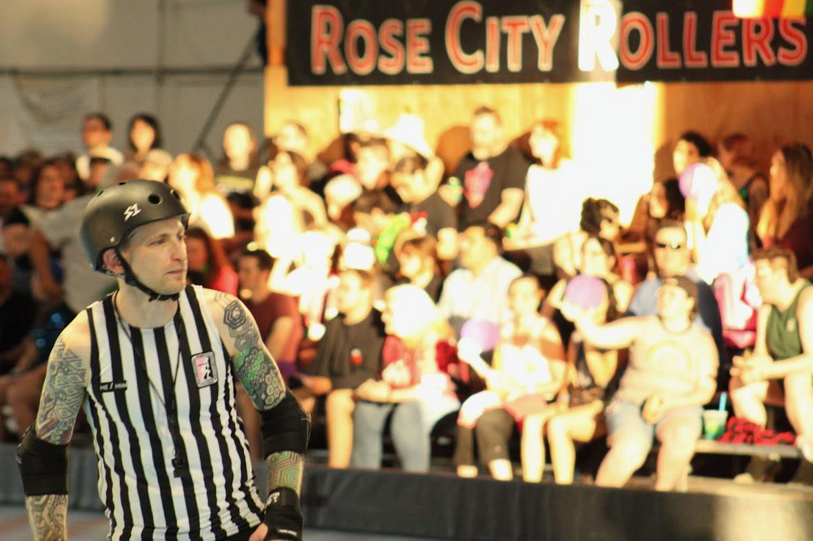{ width="400" style="filter: drop-shadow(0 0 0.2rem black)" }
        <figcaption style="font-size: 12px">
            IPR, RCR Home Team Champs, June, 2024 
            Credit: Divo
        </figcaption>
    </figure>

---

## Conclusion

I believe the unique circumstances of my life prepared me for this opportunity.  The intersection of my circumstances, choices, experiences, successes, failures, dreams, and my life's purpose combined to make this the one thing I've wanted so badly that I've poured my entire life into having the chance.

Thank you for the opportunity to apply and for considering my application.  If you select me to be a member of an officiating crew, I will reward your decision with the dedication, preparation, and performance of a champion.

<figure markdown>
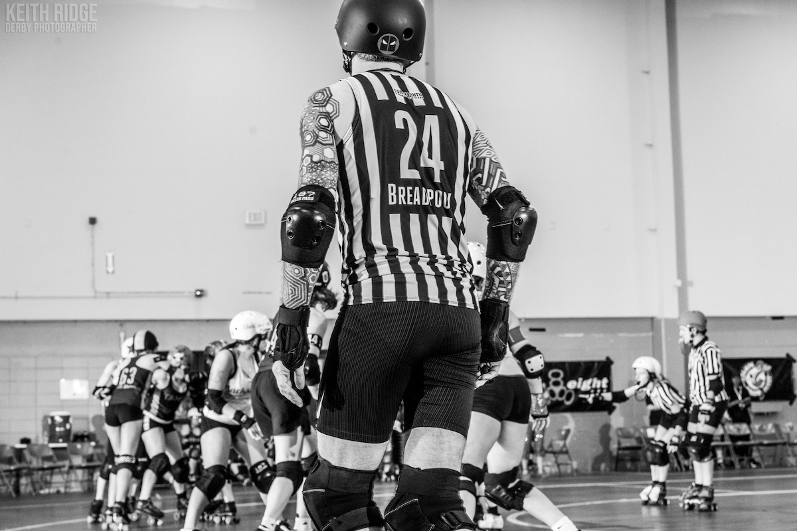{ width="500" style="filter: drop-shadow(0 0 0.2rem black)" }
    <figcaption style="font-size: 12px">
        OPR, Franky Panky JRDA Sanctioned, March, 2024 
        Credit: [Keith Ridge Derby Photos :octicons-link-external-24:](https://www.facebook.com/keithridgederbyphotos "keithridgederbyphotos on Facebook"){ target=_blank }
    </figcaption>
</figure>

---

!!! numbers "My Application By The Numbers"

    - **44K** - miles flown to officiate in the previous year.
    - **229** - games officiated in the previous two years.
    - **134** - games officiated in the previous year.
    - **100+** - hours at a PT's office since 9/19/2023 to be ready to submit this application.
    - **60+** - hours I spent preparing this application.
    - **18** - events officiated in the previous year.
    - **16** - out-of-state trips to officiate derby in the previous year.
    - **0** - regrets for all of my work and sacrifice to be ready for this moment.

    <figure markdown>
    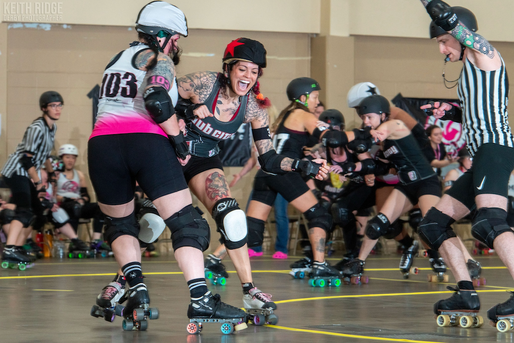{ width="500" style="filter: drop-shadow(0 0 0.2rem black)" }
        <figcaption style="font-size: 12px">
            JR, Franky Panky, Tampa vs. Dub City, March, 2024 
            Credit: [Keith Ridge Derby Photos :octicons-link-external-24:](https://www.facebook.com/keithridgederbyphotos "keithridgederbyphotos on Facebook"){ target=_blank }
        </figcaption>
    </figure>
