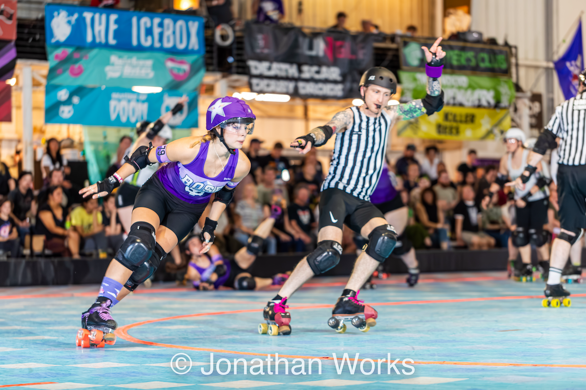
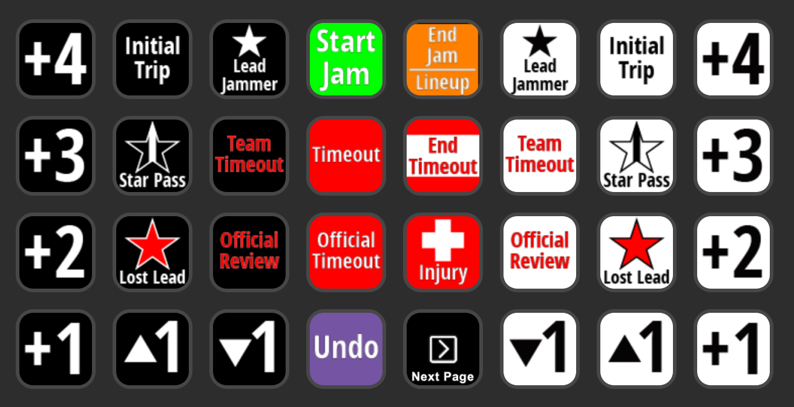
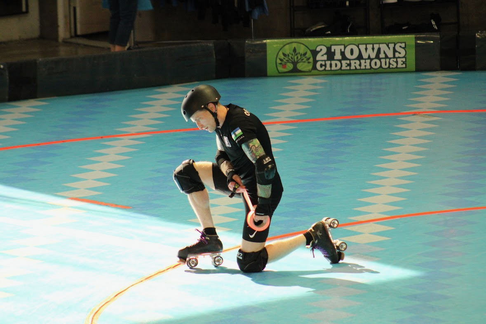

# Breadpool's Self-Evaluation

<figure markdown>
{ width="400" style="filter: drop-shadow(0 0 0.2rem black)" }
    <figcaption style="font-size: 12px">
        Breadpool (Timothy Hull) 
        Credit: [Mckay Grundstein-Helvey :octicons-link-external-24:](https://www.instagram.com/mgh2pdx "@mgh2pdx on Instagram"){ target=_blank }
    </figcaption>
</figure>

Hello! I'm **Breadpool**(1), and this site is my roller derby officiating self-evaluation.  Please use the information in this site for details about my experience, strengths, areas for growth, and to review video clips with expanded analysis.
{ .annotate }

1. !!! reference "Derby Name Meaning"

       My derby name is a combination of two things:

       1. I love to bake breads and pastries :fontawesome-solid-bread-slice:
       2. My superpower is recovering from injuries and surgeries :material-arm-flex:

The content of my self-evaluation appears in several sections, various tabs, and expandable note boxes.  Click or tap anywhere you see the :material-cursor-default-click: icon to view each part of my self-evaluation.

A Table of Contents menu appears on the left-side of all pages for quick access to separate pages:

1. [My Self-Evaluation](./index.md "Self-Evaluation") (this page).
2. [Game Video Clips](./game_video_clips.md "Game Video Clips") that detail specific instances of my officiating performances.
3. [My WFTDA Evaluations History](./evaluations.md#evaluation-history "My WFTDA Evaluations History"){ data-preview }.
4. [My WFTDA OHD](./officiating_history.md "My WFTDA OHD").

---

## About Me

=== "Dedication :material-cursor-default-click:"

    Simply for living where I happen to live, I've had the tremendous privilege of regularly learning from some of the most dedicated and experienced officials, players, coaches, league representatives, and volunteers in the world.
    
    Thank you for everything you've taught me, for your selfless support of my development, and for your dedication to the people you serve.  I promise to share what I’ve learned with anyone who wants to better themselves, and to use what you've taught me to emphatically support derby communities of all sizes, types, and ages, anywhere and everywhere derby lives.

     <figure markdown>
    { width="500" style="filter: drop-shadow(0 0 0.2rem black)" }
        <figcaption style="font-size: 12px">
            JR, Franky Panky, New Jax vs. Red Stick, March, 2024 
            Credit: [Keith Ridge Derby Photos :octicons-link-external-24:](https://www.facebook.com/keithridgederbyphotos "keithridgederbyphotos on Facebook"){ target=_blank }
        </figcaption>
    </figure>

=== "Overview :material-cursor-default-click:"

    I am intent on being an official who performs exceptionally in any role, for any type and level of gameplay, under any conditions, with any crew, anywhere, and anytime.  My self-evaluation encompasses both SO or NSO positions because I don't consider myself an "SO" or an "NSO."   I am simply an **official** who works to earn the trust of my peers so I can excel in each roller derby officiating role.
    
    I seek to continuously improve at *every* NSO and SO position because improving in any one position sharpens me in every other position.  The more I understand the nuances of each officiating role, the more empathy I can show my peers as I work to help them be as effective and comfortable in their roles as possible.
    
    I don't simply want to be excellent in every officiating role, I want to be an excellent teammate and peer in every officiating role.  That means I pay close attention to how I move, position myself, and communicate so I make it easier for each of my peers to do their jobs.

    I work every single day to develop a deeper understanding of gameplay, rules theory, and the people involved in roller derby so I can support an ongoing improvement of the experience for teams, my peer officials, volunteers, spectators, and the global roller derby community.

    <figure markdown>
    { width="350" style="filter: drop-shadow(0 0 0.2rem black)" }
        <figcaption style="font-size: 12px">
            JT, Female Division JRDA Playoffs: Santa Cruz, June, 2024 (Timothy Hull) 
            Credit: [Mckay Grundstein-Helvey :octicons-link-external-24:](https://www.instagram.com/mgh2pdx "@mgh2pdx on Instagram"){ target=_blank }
        </figcaption>
    </figure>

=== "Profile :material-cursor-default-click:"

    - **Name:** Breadpool (Timothy Hull)
    - **Pronouns:** He/Him
    - **Age:** 44
    - **Home Town:** Portland, Oregon, USA
    - **Birth Town:** Annapolis, Maryland, USA
    - **League Affiliation:** RCR
    - **Languages:** English, Brazilian Portuguese
    - **Occupation:** Automation Software Development Consultant
    - **Fun Fact:** BJJ Black Belt

    <figure markdown>
    { width="500" style="filter: drop-shadow(0 0 0.2rem black)" }
        <figcaption style="font-size: 12px">
            JR, 187 Killer Pads vs. Triple 8, RollerCon 2024 
            Credit: [WiK's Pics :octicons-link-external-24:](https://www.instagram.com/wick2o "@wick2o on Instagram"){ target=_blank }
        </figcaption>
    </figure>

=== "What Derby Officiating Means to Me :material-cursor-default-click:"

    === "Inspiration :material-cursor-default-click:"

        I am a physically disabled U.S. Army veteran, and I believe I fit within the category of people with hidden disabilities. I seek to inspire people who have physical disabilities, just like me, to do more than they or perhaps the world believes they are capable of.
        
        When I serve in an officiating role, on- or off-skates, nobody sees me and thinks I’m disabled, guesses I have an extensive injury history that includes 20 x surgeries, nor has any idea how much daily work I do to physically function, gear up and skate, and excel at high-intensity physical activities.
        
        Intense rehabilitation to recover from injuries is my superpower. For example, I served as an SO less than two weeks after a total hip replacement in 2023 because I spent hours and hours each day rehabilitating, strengthening, and specifically training to be ready to skate.
        
        **I want people with physical disabilities to see me as an example that it’s possible for them to experience joy and fulfillment from strenuous sports and activities.**

        <figure markdown>
        { width="350" style="filter: drop-shadow(0 0 0.2rem black)" }
            <figcaption style="font-size: 12px">
                OPR, RCR GNR vs. Texas Hustlers, November, 2023 
                Credit: [Jonathan Works Photography :octicons-link-external-24:](https://www.facebook.com/worksphoto "worksphoto on Facebook"){ target=_blank }
            </figcaption>
        </figure>

    === "New Hope :material-cursor-default-click:"

        I've loved intense athletic competition for as long as I can remember, first competing in a running race at the age of 5.  I love the grind of physical preparation, the struggle of mental readiness, the joy of successes, the pain of failures, and even the process to recover from the devastation of injuries, just for the chance to compete again.
        
        Military service disabilities and sports injuries now prevent me from competing in the sports I've spent most of my life learning, playing, and loving.  Losing the ability to compete in these sports in recent years crushed me, leaving me feeling without purpose and desperate for a way to fill the competitive athletic void in my life.

        Officiating roller derby has allowed me to feel like my chance to participate in competitive athletic activities isn't yet over because, at least for the time being, my body still allows me to roller skate with high intensity.  Even though I am not a competitor on the track, officiating allows me to experience the joy of competitive preparation through intense physical training, rules study, video analysis, and practicing with peers who push me to be better every day.

        <figure markdown>
        { width="400" style="filter: drop-shadow(0 0 0.2rem black)" }
            <figcaption style="font-size: 12px">
                HR, AoA vs. Rat City, October, 2023 
                Credit: [Jonathan Works Photography :octicons-link-external-24:](https://www.facebook.com/worksphoto "worksphoto on Facebook"){ target=_blank }
            </figcaption>
        </figure>

=== "My Officiating Background :material-cursor-default-click:"

    === "Non-Derby Officiating :material-cursor-default-click:"

        [I am newer to officiating roller derby](#__tabbed_2_2 "My Derby Officiating Background"), although I've been officiating various sports and competitive activities most of my life.  I started officiating when I was sixteen, operating the scoreboard at high school basketball games, and I've since officiated:

        - High school football.
        - High school Army JROTC drill competition.
        - U.S. Army recreational flag football.
        - BJJ tournaments at the local, regional, and international levels.

        I’ve been competing in sports throughout my life, including over 20 years of Brazilian Jiu-Jitsu competition. Officiating is one way I contribute to serving future generations of competitors while honoring the people who have officiated for my own competitive athletic experiences.

        Although each sport has unique officiating requirements and nuances, I find there are many common elements to the role of officiating across sports.  I make this point because I believe one of the reasons I've been able to integrate effectively with the roller derby officiating community within a few years is my prior officiating experience:

        - Conducting myself in keeping with the professional nature of an official.
        - Communicating effectively with players, coaches, other officials, staff, and spectators.
        - Understanding that even the nicest people sometimes become elevated during competition, and affording them the space to be elevated without judging them or taking things personally.
        - De-escalating intense situations between players, coaches, officials, etc.
        - Not allowing player, coach, or crowd reactions to impact my judgment or responses.
        - Observing and remembering the details of high-speed gameplay actions.
        - Understanding the importance of allowing players to determine the outcome of contests.
        - Remaining calm, composed, and effective during high-stakes competition.

        <figure markdown>
        { width="350" style="filter: drop-shadow(0 0 0.2rem black)" }
            <figcaption style="font-size: 12px">
                Referee, The Revolution 52, Puyallup, WA, July 2024 
                Credit: [Jason Tracy Photography :octicons-link-external-24:](https://www.instagram.com/pnwphotoj "@pnwphotoj on Instagram"){ target=_blank }
            </figcaption>
        </figure>

    === "Derby Officiating :material-cursor-default-click:"

        I began my derby officiating journey in August of 2022, although somewhat by accident.  My daughter was new to the roller derby community and wanted to spend more time on skates than was available to her in practices and scrimmages.  She decided to start attending officiating practice and asked that I join her so she wouldn't feel alone.
        
        I wanted to support my daughter and the roller derby community, and having skated and officiated in different capacities for the majority of my life, I felt comfortable giving roller derby officiating a shot.  I had no idea that I would leave that practice feeling like officiating roller derby was *the* thing I was meant to do.
        
        Since that day, I've poured my heart and soul into becoming a better official, believing I can serve people, many of whom live within social margins, in a way that allows them to live safer, more fulfilling lives.

        Where I happen to live affords me access to more opportunities to officiate roller derby than many people have, and I have access to highly experienced officials to learn from.  I do everything I can to use my privilege for good by officiating for leagues and teams that most need extra support. That means I frequently officiate roller derby:
        
        - Outside of my home league, often in rural areas.
        - For junior roller derby leagues and teams.
        - For beginner-level teams, including those who play modified-contact games.
        - For marginalized communities, teams, athletes, etc.
        - Whether or not the gameplay is sanctioned or adheres to regulation play guidelines.

        <figure markdown>
        { width="500" style="filter: drop-shadow(0 0 0.2rem black)" }
            <figcaption style="font-size: 12px">
                JR, Ground Control vs. Y'allhalla, May, 2024 
                Credit: [Alvin Green Jr. Photography :octicons-link-external-24:](https://www.instagram.com/algreenjr1 "@algreenjr1 on Instagram"){ target=_blank }
            </figcaption>
        </figure>

---

## What to Expect From Me

I believe the best officiating happens when a crew operates as a selfless, supportive, and blameless team that focuses on being better today than they were yesterday.  These are the qualities you can expect from me as a member of any officiating crew:

??? bread "1. My Mindset :material-cursor-default-click:"

    - I approach officiating just like I do playing any competitive sport, with the exception that my opponent isn't another person or team.
    - In my mind, **mistakes** are the opponent I ferociously train to beat, while recognizing mistakes are a relentless opponent that will never allow me to be rest.
    - I respect my opponent, although I do not fear them.
    - I seek to challenge my opponent at the highest levels because I'm driven to "win," and I prepare to be successful in the biggest moments.
    - "Winning" means my peers and I supported safe, fair gameplay in which the competing teams feel like they control the outcome.
    - I give my all to be the best teammate anyone has ever had, always seeking self-improvement and working to be someone who my peers trust, feel safe with, and love to work with.

??? bread "2. Extreme Positivity :material-cursor-default-click:"

    - I show up with high enthusiasm, friendliness, excitement, and positivity to share with the officials I serve with, no matter how challenging game conditions might be.
    - Regardless of the circumstances, I bring fist bumps, high-fives, and verbal "Let's go!" cues to support and encourage my peers throughout the duration of each contest in an event.
    - I seek responsibility for my mistakes, make in-game adjustments, avoid dwelling on my mistakes so I keep my head in the game, and immediately extend apologies, where appropriate, to the people I impact with my mistakes.
    - I have the backs of my on- and off-skates crewmates, *always*, and they can count on me to encourage them in difficult situations.
    - When my officiating peers and leadership need me to make adjustments, I don’t dig my heels in about doing things a certain way, I give them my full support and do what they need me to do.

??? bread "3. Strenuous Preparation :material-cursor-default-click:"

    - I practice developing and improving officiating skills, on- and off-skates at least 4 hours per week, and often upwards of 10 hours per week.
    - I actively seek feedback from other officials and relentlessly study game video to continuously learn and improve, and to position myself to best support safe and fair gameplay.
    - I physically train and condition 5-12 hours per week to maintain a high level of fitness, improve my ability to be in the best position to observe game action, and ensure I will not experience physical fatigue no matter how strenuous the environmental or game conditions might be.
    - I regularly study roller derby rules and cases to continuously develop a better understanding of roller derby rules theory because I believe learning to understand rules theory helps me quickly work through complex situations in a way that supports the best and safest possible gameplay experience.

??? bread "4. Empathic Listening :material-cursor-default-click:"

    - I actively listen to officials, players, and coaches with genuine effort and concern to understand their points of view.
    - I seek to build trust by showing officials and teams they are heard and understood, even in cases where we may disagree with each other.
    - I actively solicit feedback from my peer officials by telling them no feedback will hurt my feelings.
    - For me, feedback is information I can use to be better today than I was yesterday, and I want to understand my mistakes, not ignore or hide from them.

??? bread "5. Clear and Kind Communication :material-cursor-default-click:"

    - I speak to everyone with courtesy and respect, no matter how I am spoken to.
    - I do everything I can to actively communicate information with other officials in a way that promotes smooth, continuous game flow.

??? bread "6. Keeping Athletes on the Track :material-cursor-default-click:"

    - I believe gameplay is best when athletes are on the track, not in the penalty box, and I observe game action in a way that seeks to avoid issuing penalties whenever possible.
    - For any action that might create sufficient game impact to warrant penalties, I describe the game impact to myself in a way I can recite during an official review *before* I issue any penalties (e.g., "Low block on yellow 2-4; caused purple 2-4 to go down").
    - I maximize the use of verbal warnings, prescribed by gameplay rules, to help athletes avoid committing penalties.
    - When I issue penalties, I include as much "3-star" information as possible to help athletes understand my basis for issuing penalties and help them avoid being assessed with the same penalty again (e.g., "Yellow 2-4, forearm; bracing on an opponent.").

??? bread "7. Zone Ownership :material-cursor-default-click:"

    - I focus on officiating specifically within the confines of my area/zone of responsibility.
    - Said another way, I avoid immediately issuing penalties for actions I may not have the best point of view to observe.
    - If I believe I may have observed game action outside of my zone that warrants a penalty or even warrants reversing a penalty, I seek to discuss my observations with other officials during lineups to collaborate on our points of view and reach the best possible outcome.

??? bread "8. Hustle :material-cursor-default-click:"

    - No matter what I do, I move with the utmost sense of purpose, often sprinting back and forth, to show everyone around me that my concern for serving the teams and peers I officiate with is equivalent to that of the highest-level competitors.
    - I apply the skills I've developed in over 20 years of Jiu-Jitsu and Judo training and competition to reduce the probability that I will fall and to recover from any fall with precision and explosiveness.
    - If I end up on the ground, I maintain eye contact with my zone of coverage to the extent possible, and return to my assigned responsibilities immediately, even if I am in discomfort from whatever took me down.

??? bread annotate "9. Versatility :material-cursor-default-click:"

    - I actively work to keep my OHD balanced between SO and NSO roles, officiating ≈2/3 of games in SO roles and ≈1/3 of games in NSO roles.
    - Whenever needed, I am comfortable serving in any SO or NSO role, with or without advanced notice.

??? bread "10. Courage To Do What's Right :material-cursor-default-click:"

    - Making split-second, difficult decisions is simply part of being an official, and I believe that applies to all levels in all sports.
    - Of course, there are no prescriptive guidelines for what the "right" thing to do is, although my peers can count on me to use good judgment, be decisive in key moments, and own responsibility for the decisions I make, whatever the outcome.

<figure markdown>
{ width="400" style="filter: drop-shadow(0 0 0.2rem black)" }
    <figcaption style="font-size: 12px">
        OPR, Female Division JRDA Playoffs: Santa Cruz, June, 2024 
        Credit: [Mckay Grundstein-Helvey :octicons-link-external-24:](https://www.instagram.com/mgh2pdx "@mgh2pdx on Instagram"){ target=_blank }
    </figcaption>
</figure>

---

## My Strengths and Areas for Growth

Please click to expand the sections below for detailed information about my development in each officiating role.

??? bread "NSO Positions :material-cursor-default-click:"

    In each NSO position, you can expect me to consistently exhibit and excel at:

    - **Precision** - accurate timing, clear communication, and adherence to established policies and procedures.
    - **Attention to detail** - everything I do gets my absolute best effort; I do not take shortcuts, I ask questions when something seems wrong, and I do everything I can to preserve the integrity of the sport and the people within it.
    - **Thorough preparation** - I do not rely on past experience or wishful thinking to be sure I will do a good job at something.  I accept the responsibility to thoroughly study and practice my assigned roles before every single opportunity I have to officiate.
    - **Rules and procedures knowledge and currency** - I keep current with rules and procedures updates, so I am ready to take and explain the correct actions for any given situation while applying the appropriate situational discretion and judgment to facilitate safe and fair gameplay.
    - **JRDA procedures familiarity** - I frequently officiate JRDA games and continuously study JRDA-specific rules, risk management, sanctioning, officiating procedures, etc.
    - **Teamwork** - I communicate with my peer NSOs and SOs in ways that demonstrate empathy, understanding, inclusiveness, courtesy, support, respect, and validation.

    <figure markdown>
    { width="400" style="filter: drop-shadow(0 0 0.2rem black)"}
        <figcaption style="font-size: 12px">
            JT, RCR Adult Regulation Game, December 2023 
            Credit: [Steven L. Price](https://stevenlprice.smugmug.com "StevenLPrice on SmugMug"){ target=_blank } :octicons-link-external-24:
        </figcaption>
    </figure>

    ??? clipboard "HNSO/CHNSO :material-cursor-default-click:"

        === "My Strengths :material-cursor-default-click:"

            - Early partnering and preparation with my peer HR/CHR to create and demonstrate unified and collaborative officiating leadership.
            - Spending sufficient time with my crew before a game to clearly communicate instructions and respond to questions.
            - Communication with teams and host leagues to ensure I have the data necessary to prepare accurate IGRF(s).
            - Accurate pre-game IGRF preparation and post-game stats book delivery.
            - Familiarity with WFTDA/MRDA and JRDA stats books guides, and the use of the [Statsbook Tool application](https://github.com/AdamSmasherDerby/Statsbook-Tool "Statsbook-Tool on GitHub"){ target=_blank } :octicons-link-external-24:.
            - Maximizing opportunities for available officials by assigning them to dedicated roster positions instead of assigning myself to a second position.
            - Demonstrating an understanding of and experience with the responsibilities and procedures associated with each NSO position, so I can support any member of my crew who may need help.
            - Helping develop new officials by providing safe opportunities for them to learn under my mentorship or that of other experienced officials.
            - Supporting officials who are developing experience with HR/CHR roles by acting as a safety net if they need assistance.
            - Having the backs of my peer officials so they can do their jobs without concern that they might have to deal with elevated or frustrated players and coaches directly.
                - I want and seek the responsibility of de-escalating and resolving conflict between teams and officials so my peers can work in an environment where they feel safe.

        === "My Areas for Growth :material-cursor-default-click:"

            - At this stage of my development, I have limited experience in the HNSO role.
                - I am actively seeking opportunities to serve in the HNSO role, and I am beginning to earn selections within and outside of my home league.
                - As I gain experience, I will seek opportunities to serve in the HNSO and CHNSO roles at tournaments that specifically seek officials who want to develop experience in new roles, including RollerCon.
            - Although I regularly work with the WFTDA and JRDA IGRF and stats book forms, I have limited experience with the game sanctioning and stats book submission processes.
            - I have no experience serving as CHNSO or THNSO.

    ??? stopwatch "JT :material-cursor-default-click:"

        === "My Strengths :material-cursor-default-click:"

            - Deliberate and audible verbal cues, even in venues where acoustics may present challenges.
            - Deliberate and clear visual cues/hand signals.
            - Precision timing alignment between my verbal/visual cues and the scoreboard clocks.
            - Intently and actively monitoring team benches between jams to respond to requests for timeouts and ORs immediately.
            - Methodically transitioning from monitoring team benches to jam start preparation as the lineup clock approaches 0:25.  My methodology includes:
                - Ensuring medical staff are available and focused on the track area.
                - Verifying that each team has at least one blocker and one jammer in legal starting positions.
                - Checking with the SBO and SKs to be sure they are ready for the next jam to start.
                - Monitoring the HR for any indication they may not be ready to start the jam.
            - Accurately providing backup timing for the official game and jam clocks.
            - Pregame coordination with the HR/CHR and SBO to understand their specific procedural preferences and indicators.
            - Supporting the SBO with clock and timeout consumption adjustments.
            - Physical endurance to continuously deliver visual cues during game stoppages for extended periods.
            - Observing and studying game footage of experienced JTs to identify and adopt procedural techniques that improve game flow.

        === "My Areas for Growth :material-cursor-default-click:"

            - I need to improve my consistency as a JT by serving in the role more frequently.
                - I will sometimes go for weeks or months without serving as a JT, and, even with advanced preparation, it may take me several jams to relax and feel like I do not have to think about everything I'm doing and need to do.
            - I will sometimes focus so much on responding to timeouts as quickly as possible that I forget to stop my game clock stopwatch immediately.
                - I need to continue to practice holding my game clock stopwatch in a way that allows me to signal timeouts and press the "Stop" button simultaneously.

    ??? stopwatch "PBM :material-cursor-default-click:"

        === "My Strengths :material-cursor-default-click:"

            - Emphasis on precision timing:
                - Starting and stopping penalty time at the exact moments prescribed by gameplay rules.
                - Timing "stand" and "done" verbal cues such that they complete exactly when my stopwatch reaches the prescribed intervals.
            - Understanding and familiarity with jammer swap scenarios, including scenarios that require both jammers to remain seated in the penalty box during a jam (A-B-A, etc.).
            - Clear and audible verbal cues.
            - Clear visual cues/hand signals.
            - Ability to support and advise officials who are developing experience in the PBT role, including helping them correctly complete PBT paperwork.
            - Understanding of penalty codes and familiarity with the process to indicate served and unserved penalties using the PBWB.
            - Understanding of illegal actions in the penalty box area, and comfort with assessing role-specific penalties when necessary.
            - Understanding of player foul-out procedures for WFTDA/MRDA and JRDA.

        === "My Areas for Growth :material-cursor-default-click:"

            - At this stage of my development, I have limited experience in the PBM role.
                - I am actively seeking opportunities to serve in the PBM role.
                - As I gain experience, I will seek opportunities to serve in the PBM role outside of my home league and at tournaments that specifically seek officials who want to develop experience in new roles, including RollerCon.

    ??? stopwatch "PBT :material-cursor-default-click:"

        === "My Strengths :material-cursor-default-click:"

            - Emphasis on precision timing:
                - Starting and stopping penalty time at the exact moments prescribed by gameplay rules.
                - Timing "stand" and "done" verbal cues such that they complete exactly when my stopwatch hits the prescribed intervals.
            - Understanding of PBT responsibilities and timing procedures.
            - Understanding of and experience completing PBT paperwork.
            - Awareness to ensure alignment of PBT paperwork with PLT records during game stoppages.
            - Clear and audible verbal cues.
            - Clear visual cues/hand signals.
            - Experience with and composure while managing instances of high penalty volume within short periods.

        === "My Areas for Growth :material-cursor-default-click:"

            - I need to serve as a PBT more frequently in order to maintain proficiency.
                - It may take me several jams to feel like I am performing my responsibilities without having to actively think about everything I need to do.
            - I typically use a "single watch" technique to time penalties, and some CHNSOs/HNSOs prefer a "dual watch" technique that I don't practice regularly.
                - For instances when only one player is serving a penalty for the team I'm assigned to track, the single and dual watch techniques are indistinguishable on the PBT paperwork.
                - When multiple players are serving penalties simultaneously, I use a running clock to record the time each player sits, stands, and completes their penalty.
                    - Some CHNSOs/HNSOs prefer that all players sit at 0 seconds, stand at 20 seconds, and complete service at 30 seconds (assuming I'm not recording timing for a jammer swap).
                    - The single watch technique I use may show that a player sits at 16 seconds, stands at 36 seconds, and completes service at 46 seconds.
                - It's important that I practice the dual watch technique to best support the needs of my assigned CHNSOs/HNSOs.

    ??? tablet "PLT/ePLT :material-cursor-default-click:"

        === "My Strengths :material-cursor-default-click:"

            - Familiarity and experience with both the PLT paperwork and ePLT interface.
            - Completing PLT paperwork in a clear and legible way.
            - Strong understanding of WFTDA/MRDA and JRDA stats book guides.
            - Understanding of penalty codes and familiarity with quickly translating SO verbal and visual cues to penalty codes.
            - Ability to switch between PLT and ePLT at a moment's notice.
            - Awareness to ensure alignment of PLT records with PBT paperwork during game stoppages.
            - My SO experience helps me anticipate and quickly process SO verbal and visual cues.
            - Regularly working with CRG, including beta versions, allows me to help troubleshoot and recover from ePLT software connectivity issues.
            - Recovering from accidental or incorrect ePLT interface taps (box trips, served penalties, etc.)
            - Familiarity and experience with using the ePLT interface to perform less common tasks, including:
                - Mark a player as having to sit for three jams.
                - Adding and removing box trips.
                - Player expulsions.
            - Comfort with supporting the development of my peer officials in both the PLT and ePLT roles.
            - Quickly identifying and marking the jammer and pivot in the ePLT interface during lineups so the SBO can focus on other responsibilities.

        === "My Areas for Growth :material-cursor-default-click:"

            - I am dyslexic, and I sometimes struggle to quickly and correctly identify all non-pivot blockers participating in a given jam.
            - While serving in the ePLT role, I need to improve my timing precision for marking the start and end of box trips.
                - I will occasionally be slow to indicate when a player completes their penalty service.
            - I lack experience and practice with:
                - PLT/ePLT recording of non-player expulsions.
                - The separate roles of PT and LT.

    ??? clipboard "PW :material-cursor-default-click:"

        === "My Strengths :material-cursor-default-click:"

            - Comfort with supporting the development of officials who are learning the PLT/ePLT roles by:
                - Quickly and accurately translating and relaying SO-issued penalties.
                - Teaching the stats book guide prescribed methodologies for accurately recording penalties and lineups.

        === "My Areas for Growth :material-cursor-default-click:"

            - I do not frequently serve in the PW role, and it can take me several months to understand the needs of the officials serving in PLT/ePLT roles.
            - I need to be more proactive as a PW and communicate better with officials serving in the PLT/ePLT roles before a game so I can provide them with the most precise and helpful feedback.

    ??? clipboard "SK :material-cursor-default-click:"

        === "My Strengths :material-cursor-default-click:"

            - Experience accurately completing SK paperwork.
            - Clear and continuous two-way verbal communication with the SBO.
            - Awareness to continuously ensure alignment of SK paperwork with the SBO throughout a game.
            - Clear and continuous two-way visual communication with my assigned JR.
            - Supporting a JR if they happen to lose track of which trip their jammer is on using visual cues that ask for confirmation.
            - Thorough understanding of:
                - JR responsibilities and communication needs.
                - Scoring trips, including less common scenarios like negative trips, etc.
                - Scenarios where a jammer loses the ability to earn lead, whether or not the scenario is common.
                - Scenarios where a jammer has *not* lost lead, even if their helmet cover is not on their helmet.
            - Ability to support developing JRs by:
                - Providing feedback that helps them comfortably learn and build confidence in the JR role.
                - Sharing insights regarding the nuances of the JR role and how they can best support gameplay.

        === "My Areas for Growth :material-cursor-default-click:"

            - I do not serve in the SK role frequently, and it can take me several jams to adapt to the communication needs of the SBO and my assigned JR.

    ??? laptop "SBO :material-cursor-default-click:"

        === "My Strengths :material-cursor-default-click:"

            - Extensive practice in the SBO role, with and without SK support.
            - Precision clock operation and timely display updates (points, timeouts, etc.).
            - Extensive experience working with, diagnosing, troubleshooting, and supporting CRG on Windows, macOS, and Linux platforms.
            - Extensive experience importing and exporting stats book files before and after games.
            - Experience recovering CRG from errors.
            - Experience customizing CRG to support specific team, venue, league, sponsor, audience, and broadcast/stream needs including:
                - Team logos, team titles/names, and scoreboard display colors.
                - Advertisement banners.
                - Stream overlays.
            - Actively following CRG development, reading developer notes and feedback (on [GitHub :octicons-link-external-24:](https://github.com/rollerderby/scoreboard "CRG on GitHub"){ target=_blank }), and routinely working with and testing beta versions of CRG.
             - For practice, I routinely:
                - Operate my own offline version of CRG during tournaments for games I'm not scheduled to officiate.
                - Serve as SBO during scrimmages.
                - Teach my peer officials the SBO role.

        === "My Areas for Growth :material-cursor-default-click:"

            - Limited experience operating the scoreboard during games.
                - The majority of my SBO experience is during scrimmages.
                - I actively seek opportunities to serve as an SBO during local and regional games so that my OHD indicates a sufficient history to have opportunities for SBO operation outside of my region and during tournaments.
    
    ??? clipboard "ALTN :material-cursor-default-click:"

        === "My Strengths :material-cursor-default-click:"

            - I have sufficient knowledge and experience with each NSO role to confidently fill any position of need at any time.
                - I continuously study and practice each NSO role to remain ready to perform well for any level or type of derby.

        === "My Areas for Growth :material-cursor-default-click:"

            - I do not have any specific areas for growth in the ALTN role at this time.

??? bread "SO Positions :material-cursor-default-click:"

    In any SO position, you can expect me to consistently exhibit and excel at:

    - **Player position awareness** - I maintain an active understanding which players have, earn, retain, lose, and reestablish superior positioning as players go OOB and return to in-bounds positions.
    - **Contact initiation awareness** - I thoroughly assess and understand which players initiate contact with other players during fast-paced gameplay.
    - **Game impact awareness** - I thoroughly assess game impact *before* I issue or decline to issue penalties.
    - **Detailed situational recall** - I remember and can recall detailed information about the actions I observe, including player-specific details (team and jersey number).
    - **Positioning** - I dynamically position and reposition myself to always be in the best possible position to observe game action.
    - **Whistle clarity** - I use clear, slow, and slightly prolonged whistle blasts to help my peer officials in SO and NSO roles understand where and when to turn their attention.
    - **Verbal and visual cue clarity** - I use highly audible/visible, deliberately slow, and consistently repeated verbal and visual cues to help my peer officials in SO and NSO roles understand exactly what I observe and report.
    - **Multitask capacity** -  I deliver verbal and visual cues, including penalties, while maintaining the appropriate positioning for my SO role.
    - **Ongoing player awareness** - I maintain observation of players before, during, and after each jam to ensure any potential contact or communication between teams has oversight.
    - **Jam participant tracking** - I continuously track the number of players and the positions for each player on each team before and during each jam.
    - **Rules knowledge** - I understand and apply roller derby rules in keeping with established rules theory and the appropriate situational discretion and judgment to facilitate safe and fair gameplay.
    - **JRDA procedures familiarity** - I frequently officiate JRDA games and continuously study JRDA-specific rules, risk management, sanctioning, officiating procedures, etc.
    - **Teamwork** - I behave in a way that shows inclusiveness, courtesy, support, respect, and validation to NSOs.

    <figure markdown>
    { width="400" style="filter: drop-shadow(0 0 0.2rem black)"}
        <figcaption style="font-size: 12px">
            JR, 187 Killer Pads vs. Triple 8, RollerCon 2024 
            Credit: [Jenni Weber Photography](https://www.instagram.com/jenniwebberphotography "@jenniwebberphotography on Instagram"){ target=_blank } :octicons-link-external-24:
        </figcaption>
    </figure>

    ??? whistle "Skating Skills :material-cursor-default-click:"

        === "My Strengths :material-cursor-default-click:"

            - General and position-specific skating skills that are among the best of my peers and allow me to reliably be in the best possible position to observe the most relevant game action without consciously thinking about skating.
            - Elite physical and mental conditioning and endurance due to thousands of hours of experience in high-intensity athletic training and competitive environments.
            - Top-end speed, forward and backward, in derby and non-derby directions, throughout the skating surface area.
            - Rapid acceleration skills, forward and backward, allow me to burst to full speed, keep pace with, and rapidly catch up to the fastest players in the world if I am forced out of position.
            - Precision stops with equivalent skill to my left and right sides while moving forward and backward.
            - Lateral movement skills and strong wheel-based stops (hockey stops, power slides, backward plows, etc.) allow me to face the front of my body toward the track during most gameplay situations and immediately change directions at any time.
            - Body control that allows me to operate effectively and avoid obstacles in compressed spaces, including narrow OPR lanes and while adjacent to downed players.
            - Footwork skills that allow me to avoid contact with players and remain upright in situations where they may not be able to avoid making contact with me.
            - Situational awareness that allows me to position my body such that I create a small profile.
                - Although I am often among the taller officials I serve with (5' 10" off-skates), I am aware of the space I occupy and use various techniques to avoid obscuring game action from my peers.
            - Adaptability to different track surfaces and conditions.
            - Immediate and explosive returns to an upright and effective position if I fall or am forced to the ground.
            - Capacity to maintain eye contact with my assigned area(s) of responsibility in almost any situation.

        === "My Areas for Growth :material-cursor-default-click:"

            - While I consider myself someone who does not frequently fall, I skate aggressively to be and remain in the best possible position to observe game action.
                - Skating aggressively can occasionally cause me to fall.
            - My backward acceleration to full speed from a complete stop in derby and non-derby directions has room to improve.
            - I use wheel stops to create a “narrow” profile while moving laterally, and doing so extends my legs, which can occasionally cause contact with players and other officials.  I'm working to make my narrow profile more compact without compromising stability.

    ??? whistle "HR/CHR :material-cursor-default-click:"

        === "My Strengths :material-cursor-default-click:"

            - Early partnering and preparation with my peer HNSO/CHNSO to create and demonstrate unified and collaborative officiating.
            - Spending sufficient time with my crew before a game to clearly communicate my instructions, answer questions, and provide any necessary clarifications.
            - Maximizing opportunities for my peers to officiate by assigning them to all available roster positions, including the ALTR position.
            - Understanding of and experience with the responsibilities and procedures associated with each SO position allows me to support any member of my crew who may need help with positioning, skating techniques, and role-specific responsibilities.
            - Helping develop new officials by providing safe opportunities for them to learn under my mentorship or that of other experienced officials.
            - Supporting officials who are developing experience with HNSO/CHNSO roles by acting as a safety net if they need assistance.
            - Helping guide and adjust the penalty game impact spectrum amongst my crew to help limit the number of player and team penalties as much as possible.
            - Communicating with players and teams in a way that seeks to understand their points of view.
            - Managing game flow by:
                - Limiting the duration and frequency of OTOs whenever possible.
                - Working with the JT to ensure the lineup clock reaches 25 seconds before stopping the game clock for an OTO (except for injury situations).
                - Clear, specific, decisive, and timely communication with teams, officials, and game audiences during ORs.
            - Strategically using OTOs as a mechanism to show fair and good faith to players and coaches.  For example:
                - If a coach or captain has a concern I can't fully hear or respond to during lineups, I will use an OTO when digression feels appropriate to ensure I am not dismissive of their concerns.
                - If I need to address a concern with teams (too many pack penalties, concern for excessive high contact, etc.), I will use an OTO to speak with coaches and captains rather than continuing to penalize players until a team or teams use their timeouts to address the concern with me.
            - Having the backs of my peer officials so they can do their jobs without concern that they are responsible for interacting with elevated or frustrated players and coaches directly.
                - I want and seek the responsibility of de-escalating and resolving conflict between teams and officials so my peers can work in an environment where they feel safe.
            - Remaining calm, collected, positive, and supportive during tense gameplay situations or when officiating errors occur.
            - Providing in-game and post-game feedback to officials who consent to feedback.

        === "My Areas for Growth :material-cursor-default-click:"

            - I often pass on opportunities to serve in an HR role so I can afford those opportunities to other officials.
                - I need to advocate for myself to seek and accept more HR responsibilities.
            - When assigned to an HR or CHR role, especially in a tournament when I'm working with officials who I many not be familiar with, I need to study game video of the individual crew members to understand:
                - Their strengths and areas for growth.
                - How to best position them for success.
                - How to appropriately challenge them to improve.
            - I have no experience serving as a THR.

    ??? whistle "OPR :material-cursor-default-click:"

        === "My Strengths :material-cursor-default-click:"

            - High proficiency at each OPR position and the capacity to switch between any OPR position at any time without disrupting gameplay or creating a coverage gap.
            - Being the earliest and most decisive "dropping" OPR in the world, seeking to rapidly stop, accelerate in non-derby direction, and recover a new position whenever the pack's speed has even the slightest potential to put me or my peers out of position.
            - Awareness of earned passes within my zone of responsibility, including player details.
                - Communicating earned pass information to JRs whenever necessary.
            - Frequent communication with my OPR peers to ensure our collective positioning and ability to observe game actions is optimal.
            - Non-verbal communication with players (pointing) reporting to and returning from the penalty box to help ensure they enter and exit the track safely and avoid contact with officials.
            - Lateral movement skills that allow me to predominantly face my entire body toward the pack, giving me the best possible view of the pack and allowing me to rapidly accelerate and decelerate in any direction at any time.

        === "My Areas for Growth :material-cursor-default-click:"

            - I, generally, do not advocate for a specific OPR position preference, and serve in whichever position my peers least prefer for themselves; typically the front OPR position.
                - This behavior results in limited opportunities to build game experience in other OPR roles, and I need to consider my own development in better balance with the requests of my peers.
            - I tend to be passive about my assignment-specific positioning relative to other officials, in particular when I serve in the middle or front OPR positions.
                - I typically adapt my own positioning to the positioning of my adjacent peers rather than take the more active approach of positioning myself where I believe I should be.
                - If I were to take a more active approach to positioning, I believe I might invite constructive communication, debate, and feedback about how my peers and I can improve our overall positioning as an OPR unit.
            - I will occasionally focus so much attention on alignment with my individual zone/wall of coverage that I don't anticipate overall pack and player movement correctly.
                - For example, from the rear and middle OPR positions, I may observe player "A" legally block opposing player "B" OOB directly in front of me.
                - Instead of remaining in precise alignment with my area/wall of responsibility, I need to better anticipate player "B" immediately attempting to reenter the track before player "A" can skate quickly enough in non-derby direction to draw a cut on player "B."
                - I am working on shifting myself slightly in non-derby direction in these situations so I can precisely observe the position of each player's hips at the exact moment player "B" returns to a fully in-bounds position.

        === "My Positioning Methodology :material-cursor-default-click:"

            - As a **rear** OPR, I am, generally:

                1. Parallel with a well-defined rear wall.
                2. Ready to rapidly accelerate in non-derby direction to follow and remain even with players up to the trailing edge of the rear engagement zone.
                3. Shifting slightly behind the rear wall when jammers approach, so I can observe contact to the rear wall.
                3. Shifting slightly in front of the rear wall to observe for illegal blocking techniques that create game impact.
                4. In position to observe player positioning relative to the jammer line and outside boundary at the start of each jam.

            - As a **middle** OPR, I am, generally:

                1. Parallel with a well-defined front wall of 3+ blockers.
                2. Ready to rapidly accelerate in non-derby direction to observe the rear wall from the front when the front wall has 2 or fewer blockers.
                3. Ready to reposition to be parallel with the rear wall when the rear OPR follows blockers moving in non-derby direction to the edge of the rear engagement zone, and ready to return to observing the front wall as the rear OPR reassumes control of the rear wall.
                4. In position to observe player positioning relative to the pivot line and outside boundary at the start of each jam.

            - As a **front** OPR, I am, generally:

                1. 7-12 feet in front of the pack, directly next to the outside boundary, looking in non-derby direction when the front wall has 3+ blockers.
                2. Ready to rapidly transition to be parallel with a front wall of 2 or fewer blockers while maintaining a position that prevents blockers from getting forward of my position.
                3. Ready to reposition to be parallel with the front wall when the middle OPR positions themselves to be parallel with the rear wall and ready to return to a position forward of the front wall when the middle OPR positions themselves to be parallel with the front wall.

    ??? whistle "JR :material-cursor-default-click:"

        === "My Strengths :material-cursor-default-click:"

            - Keeping eyes on my jammer at *all* times to ensure nothing they do goes unobserved.
            - Clear, kind, and supportive communication with my SK, before, during, and after each game.
            - Awareness of potential NOTT points and understanding of when a jammer earns and does not earn those points.
            - Timely and accurate tracking and recall, by player, of earned passes, points, superior position, and positional gain.
            - Confident points reporting immediately after a jam ends (after the fourth whistle, not the twelfth whistle).
            - Continuous monitoring of the relationship between what I report to my SK and the information on the scoreboard.
            - Awareness of the space I occupy, how my position impacts my peer JR, and the ability to adapt to support fluid, dynamic movement with my peer JR throughout a tournament.
            - Anticipating situations that may result in a star pass that is difficult to see.
            - Lateral movement that allows me to predominantly face my entire body toward my jammer, giving me the best possible view of my jammer and allowing me to rapidly accelerate and decelerate in any direction, at any time.
            - Precision responsiveness to jammer call-off requests.
            - Thorough understanding of SK responsibilities and communication needs.
            - Ability to support developing SKs by providing feedback that helps them comfortably learn and build confidence in the SK role.

        === "My Areas for Growth :material-cursor-default-click:"

            - In situations where I believe my jammer is incorrectly penalized by another official, I can sometimes lose focus while attempting to rationalize the situation.  That loss of focus can result in:
                - Losing track of the current trip, which points (if any) are earned and which are still available to earn.
                - Indecisiveness about whether the specific game circumstances warrant me allowing my jammer to serve the penalty or immediately overturning the penalty (in either case, I would discuss the penalty with the issuing official after the current jam).
            - Although I am comfortable adapting my positioning to the specific style and needs of my peer JR, I will sometimes forget to implement adaptations consistently and disrupt their path.

        === "My Positioning Methodology :material-cursor-default-click:"

            - Before each jam, I identify my jammer and align myself with their position, making sure I can observe their actions before and after the jam starting whistle.
            - Precise alignment with my jammer throughout the duration of each jam in a way that allows me to continuously and accurately observe my jammer's position relative to other players.
            - Frequent use of wheel-stopping techniques (hockey stops, power slides, etc.) to keep alignment with my jammer as they dynamically move within the pack and throughout the track.

    ??? whistle "IPR :material-cursor-default-click:"

        === "My Strengths :material-cursor-default-click:"

            As IPR, front or rear, you can expect me to consistently exhibit and excel at:

            - Comfort and confidence working from the front or rear IPR positions, depending on my HR/CHR's position preference.
            - Ability to define and track pack location plus adapt to the to the pack definition metrics of my peer IPR.
            - Ability to adapt to the pack reformation penalty metrics of my peer IPR such that reformation penalty distribution is fair and consistent.
            - Ability to monitor the precise location of skaters to accurately report pack conditions and movement.
            - Awareness of situations that may result in unexpected no-pack split scenarios:
                - Players returning from the penalty box.
                - Players recycling themselves behind all pack skaters and returning to an in-bounds, in-play position.
            - Clear and loud verbal and visual cues that allow players to quickly understand and respond to warnings before penalty assessment.
            - Ability to rapidly and dynamically change my positioning and focus as game conditions and pack activities dictate.
            - Capacity to relay information information between officials, including relaying penalties from OPRs to PLTs.
            - Capacity to relay to JRs which players are OOP, NOTT, etc. and when, to support JRs accurate tracking and points reporting.
            - Ongoing communication with other officials about pack location and player positioning relative to the pack, specifically communicating the location of jammers relative to the pack and front engagement zone to JRs.
            - Awareness of where players re-enter the track relative to the front engagement zone.
            - Ability to "chase down" and issue an OOP warning to a player who leaves the front engagement zone while believing they are a jammer, after unsuccessfully taking a star pass.
            - Ability to rapidly accelerate while skating backward and skate backward at high speed without the need to look at the track boundary to ensure I remain off of the gameplay area.

        === "My Areas for Growth :material-cursor-default-click:"

            - My pack definition is often too "academic" for practical gameplay, which results in me issuing more verbal cues than are necessary.
                - For example, I have the tendency to issue a "no-pack" warning when I believe the distance between players who are maintaining pack connectivity exceeds ten feet.
                - However, in many of these cases, immediate pack reformation is imminent, and gameplay would benefit from me reducing unnecessary verbal cues.
            - During gameplay with rapid, dynamic pack movement, I tend to over-focus on pack definition and engagement zone tracking which can cause me to not be as mindful as necessary of contact-based penalties.
            - Specifically as a front IPR, when I am working with a rear IPR that I do not work with regularly, I can be slow to adapt to their assessment of distances between players.
                - This can result in me issuing "no-pack" warnings when there the rear IPR defines a pack.
                - I am actively focused on my early-game attentiveness and adaptation to the way my rear IPR peer performs their pack definition.
            - I am continuously working to improve my pack identification accuracy.  My most common errors are:
                - Issuing a no-pack warning when I do not see a player who is maintaining pack.
                - Incorrectly counting a player for pack definition who partially OOB.
                - Counting players for pack definition who have yet to yield after receiving a warning for a false start.

        === "My Positioning Methodology :material-cursor-default-click:"

            - As a **front** IPR, I am, generally:

                1. 7-10 feet in front of the pack, directly next to the inside boundary looking in non-derby direction when the pack is well-defined and managed by the rear IPR.
                2. Ready to rapidly transition to a position where I am centered on the pack when the rear IPR moves to follow players in the rear engagement zone.
                3. Ready to move out of the path of both JRs and quickly recover my original position.
                4. Ready to provide primary pack definition coverage for the rear IPR in the event they are not available at the start of a jam or become unavailable during a jam.
            
            - As a **rear** IPR, I am, generally:

                1. Centered on the pack when the pack is well-defined.
                2. Ready to rapidly accelerate in non-derby direction to follow and remain even with players up to the trailing edge of the rear engagement zone.
                3. Shifting slightly behind the rear wall when jammers approach, so I can observe contact to the rear wall.
                4. Shifting slightly in front of the rear wall to observe for illegal blocking techniques that create game impact.
                5. Ready to move out of the path of both JRs and quickly recover my original position.
                6. In position to observe player positioning relative to the jammer line and inside boundary at the start of each jam.

    ??? clipboard "ALTR :material-cursor-default-click:"

        === "My Strengths :material-cursor-default-click:"

            I take the ALTR role very seriously and seek opportunities to serve as an ALTR.  You can expect me to volunteer to serve as an ALTR with enthusiasm, engagement, and a focus on helping my officiating peers excel. As an ALTR, you can expect me to consistently exhibit and excel at:

            - Preparing myself physically before a game such that I could be activated at any moment of need, and maintaining that physical readiness throughout a game.
            - Maintaining situational awareness of game action so I am ready to enter a game or provide relevant feedback at any moment.
            - Readiness for activation to any position.
            - Readiness to provide individual or crew feedback at the request of the HR/CHR.
            - Understanding how to accurately record essential OR information.
            - Readiness to report game summary information (team/or penalty counts, number of timeouts remaining, etc.) to the HR/CHR at their request.
            - Attentiveness to the condition of the track, tape, rope, etc. and maintenance support.

        === "My Areas for Growth :material-cursor-default-click:"

            - I do not have any specific areas for growth in the ALTR role at this time.

<figure markdown>
{ width="400" style="filter: drop-shadow(0 0 0.2rem black)" }
    <figcaption style="font-size: 12px">
        IPR, RCR Home Team Champs, June, 2024 
        Credit: Divo
    </figcaption>
</figure>

---

## Other Derby Contributions and Experience

??? star "RCR Volunteer Service :material-cursor-default-click:"

    - 2,500+ hours of volunteer contributions to roller derby since August of 2022 including:
        - 450+ hours of officiating RCR adult and junior scrimmages.
        - 110+ hours of attending RCR officiating practices.
        - 50+ hours of preparing for and leading RCR adult and junior officiating practices.

??? whistle "RCR Officiating Development :material-cursor-default-click:"

    - Regular officiating practice coach.
    - Co-founded an ongoing junior officiating training program in 2023 for which I serve as the primary coach.
    - Deployed a streaming device to the scoreboard projector in 2024 to enable screen mirroring as an officiating practice support and development tool.

??? clipboard "RCR OC Membership :material-cursor-default-click:"

    - OC member from January to December of 2023.
    - OC member from January 2024 to present.
    - OC co-chair-elect for a term from January to December of 2025.

??? technology "RCR Technology Enhancements :material-cursor-default-click:"

    - Led an initiative to refresh officiating technology in 2023 that resulted in the setup of and migration to:
        - A new SBO computer.
        - Two new ePLT tablets.
        - 40+ new home and visiting team logos reorganized into a modern, intuitive file hierarchy.
        - Usage of RCR cloud storage to improve shared file access and improve events coordination with RCR.
    - Developed and actively enhancing an open-source application ([Star Pass :octicons-link-external-24:](https://github.com/rcrderby/star-pass "Star Pass Volunteer Management Automation Application on GitHub"){ target=_blank }) that automates RCR-wide volunteer opportunity management.

??? code "CRG Open-Source Contributions :material-cursor-default-click:"

    - Developed and released software that automates running [CRG in a Container Runtime](https://github.com/rcrderby/crg-container "CRG Container Application on GitHub"){ target=_blank }.
    - Developed and released configuration, instructions, and button image files that allow SBOs to use Elgato Stream Deck products as a [simplified interface to control CRG :octicons-link-external-24:](https://github.com/rcrderby/crg-streamdeck "CRG Stream Deck Application on GitHub"){ target=_blank }.
        - Intended primarily to lower the CRG/SBO training barrier to officials of all experience levels.

    <figure markdown>
    { width="400" style="filter: drop-shadow(0 0 0.2rem black)" }
        <figcaption style="font-size: 12px">
            [Example Stream Deck Controller Interface #1 :octicons-link-external-24:](https://github.com/rcrderby/crg-streamdeck/blob/main/docs/images/stream-deck/32-button-profiles/stream-deck-32-black-vs-white-page-1.png "Example Stream Deck for CRG Controller Interface #1"){ target=_blank }
        </figcaption>
    </figure>

    <figure markdown>
    { width="400" style="filter: drop-shadow(0 0 0.2rem black)" }
        <figcaption style="font-size: 12px">
            [Example Stream Deck Controller Interface #2 :octicons-link-external-24:](https://github.com/rcrderby/crg-streamdeck/blob/main/docs/images/stream-deck/32-button-profiles/stream-deck-32-black-vs-white-page-2.png "Example Stream Deck for CRG Controller Interface #2"){ target=_blank }
        </figcaption>
    </figure>

<figure markdown>
{ width="400" style="filter: drop-shadow(0 0 0.2rem black)" }
    <figcaption style="font-size: 12px">
        ALTR, RCR Home Team Champs, June, 2024 
        Credit: Divo
    </figcaption>
</figure>

---

## Conclusion

Thank you for reviewing my self-assessment.  I look forward to your feedback and am grateful for your support of my ongoing officiating development.

<figure markdown>
{ width="500" style="filter: drop-shadow(0 0 0.2rem black)" }
    <figcaption style="font-size: 12px">
        OPR, Franky Panky JRDA Sanctioned, March, 2024 
        Credit: [Keith Ridge Derby Photos :octicons-link-external-24:](https://www.facebook.com/keithridgederbyphotos "keithridgederbyphotos on Facebook"){ target=_blank }
    </figcaption>
</figure>
